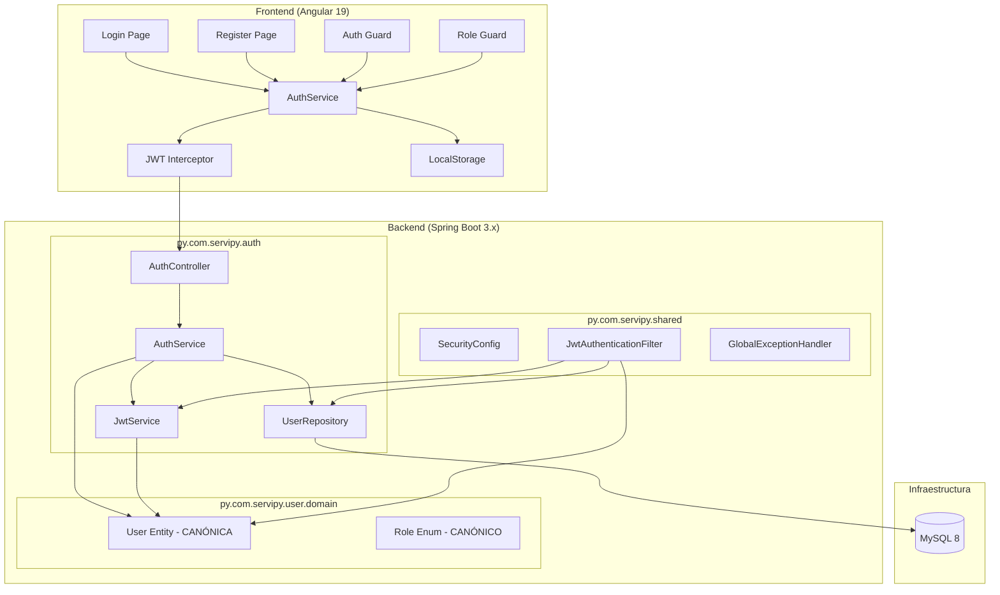
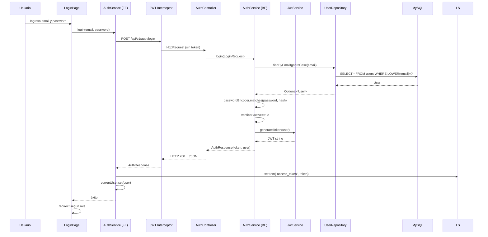
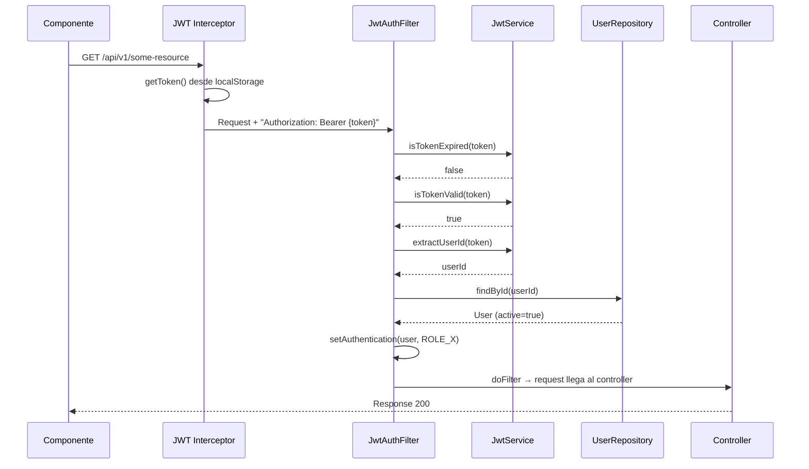

# Documento de Diseño — Autenticación y Autorización

## Resumen

Este documento describe el diseño técnico para la infraestructura de autenticación y autorización de ServiPy. Cubre la consolidación de la entidad User en una única ubicación canónica (`py.com.servipy.user.domain.User`), el flujo de registro y login con JWT stateless, la autorización basada en roles, la configuración CORS, y los componentes frontend (servicio de auth, interceptor, guards, páginas de login/registro).

El diseño se basa en el código existente ya implementado en el proyecto, focalizándose en la migración/consolidación de entidades y la implementación completa del frontend de autenticación.

---

## Arquitectura

### Diagrama de Alto Nivel



### Diagrama de Secuencia — Login



### Diagrama de Secuencia — Request Autenticada



---

## Componentes e Interfaces

### Backend

#### 1. `py.com.servipy.auth.application.AuthService`

Servicio de aplicación que orquesta registro y login. Tras la consolidación, importará `py.com.servipy.user.domain.User` y `py.com.servipy.user.domain.Role`.

```java
// Métodos públicos
AuthResponse registerClient(RegisterRequest request);
AuthResponse registerProfessional(RegisterRequest request);
AuthResponse login(LoginRequest request);
UserResponse getCurrentUser(Long userId);
```

**Dependencias:** `UserRepository`, `PasswordEncoder`, `JwtService`

#### 2. `py.com.servipy.auth.application.JwtService`

Servicio stateless para generación y validación de JWT. Tras la consolidación, importará `py.com.servipy.user.domain.User`.

```java
// Métodos públicos
String generateToken(User user);
boolean isTokenValid(String token);
boolean isTokenExpired(String token);
Long extractUserId(String token);
String extractEmail(String token);
String extractRole(String token);
Date extractExpiration(String token);
```

**Configuración:**
- `app.jwt.secret` — clave HMAC (variable de entorno, mínimo 256 bits)
- `app.jwt.expiration-minutes` — vida del token (15-30 min)

#### 3. `py.com.servipy.auth.infrastructure.web.AuthController`

Controller REST bajo `/api/v1/auth`. No cambia su interfaz pública, solo sus imports internos.

| Endpoint | Método | Descripción |
|----------|--------|-------------|
| `/register/client` | POST | Registro de cliente |
| `/register/professional` | POST | Registro de profesional |
| `/login` | POST | Inicio de sesión |
| `/me` | GET | Datos del usuario autenticado |

#### 4. `py.com.servipy.shared.web.JwtAuthenticationFilter`

Filtro `OncePerRequestFilter` que intercepta requests, valida JWT y establece `SecurityContext`. Tras la consolidación, importará la entidad canónica.

**Flujo del filtro:**
1. Sin header `Authorization` o sin prefijo `Bearer ` → `doFilter` sin autenticar
2. Token expirado → respuesta 401 `TOKEN_EXPIRED`
3. Token inválido (firma/formato) → respuesta 401 `UNAUTHORIZED`
4. Token válido + usuario no existe o inactivo → respuesta 401 `UNAUTHORIZED`
5. Token válido + usuario activo → setAuthentication con `ROLE_{role}`

#### 5. `py.com.servipy.shared.config.SecurityConfig`

Configuración de Spring Security. Se añadirá la configuración CORS.

```java
// Nuevos beans/configuración
@Bean
CorsConfigurationSource corsConfigurationSource(); // Configurable por entorno
```

**Reglas de acceso (sin cambios):**
- Públicos: `/api/v1/auth/login`, `/api/v1/auth/register/**`, `/api/v1/health`, `/actuator/health`
- Admin: `/api/v1/admin/**` → `hasRole("ADMIN")`
- Todo lo demás: `authenticated()`

#### 6. `py.com.servipy.auth.infrastructure.persistence.UserRepository`

Interfaz Spring Data JPA. Tras la consolidación, apuntará a `py.com.servipy.user.domain.User`.

```java
public interface UserRepository extends JpaRepository<User, Long> {
    Optional<User> findByEmailIgnoreCase(String email);
    boolean existsByEmailIgnoreCase(String email);
}
```

### Frontend

#### 7. `AuthService` (core/auth/auth.service.ts)

Servicio singleton para gestión de estado de autenticación.

```typescript
@Injectable({ providedIn: 'root' })
export class AuthService {
  // Signals
  currentUser: WritableSignal<UserResponse | null>;

  // Métodos
  login(email: string, password: string): Observable<AuthResponse>;
  register(name: string, email: string, password: string, roleType: 'client' | 'professional'): Observable<AuthResponse>;
  logout(): void;
  getToken(): string | null;
  isAuthenticated(): boolean;
  getUserRole(): string | null;
  restoreSession(): void;  // Llamado en inicialización
}
```

**Almacenamiento:** `localStorage` bajo la clave `"access_token"`.

#### 8. `jwtInterceptor` (core/http/jwt.interceptor.ts)

Interceptor funcional que adjunta el token Bearer y maneja 401.

```typescript
export const jwtInterceptor: HttpInterceptorFn = (req, next) => {
  // 1. Si hay token → clonar request con header Authorization
  // 2. Si respuesta 401 → ejecutar logout y redirect a /login
  // 3. Si no hay token → enviar sin modificar
};
```

#### 9. `authGuard` (core/guards/auth.guard.ts)

Guard funcional que protege rutas autenticadas.

```typescript
export const authGuard: CanActivateFn = (route, state) => {
  // Si isAuthenticated() → true
  // Si no → redirect a /login, return false
};
```

#### 10. `roleGuard` (core/guards/role.guard.ts)

Guard funcional que protege rutas por rol.

```typescript
export const roleGuard: CanActivateFn = (route, state) => {
  // Leer roles permitidos de route.data['roles']
  // Si getUserRole() está en la lista → true
  // Si no → redirect a /, return false
};
```

#### 11. `LoginComponent` (features/authentication/login/)

Componente standalone con formulario reactivo (email + password).

#### 12. `RegisterComponent` (features/authentication/register/)

Componente standalone con formulario reactivo (name + email + password + tipo de cuenta).

---

## Modelos de Datos

### Entidad Canónica: `py.com.servipy.user.domain.User`

| Campo | Tipo | Restricciones |
|-------|------|---------------|
| id | Long | PK, auto-increment |
| name | String | NOT NULL, length 2-150 |
| email | String | NOT NULL, UNIQUE, max 255 |
| passwordHash | String | NOT NULL |
| role | Role (enum) | NOT NULL: CLIENT, PROFESSIONAL, ADMIN |
| active | Boolean | NOT NULL, default true |
| createdAt | Instant | NOT NULL, immutable |
| updatedAt | Instant | NOT NULL |

### Migración de Entidad

La consolidación consiste en:

1. **Eliminar** `py.com.servipy.auth.domain.User` y `py.com.servipy.auth.domain.Role`
2. **Actualizar imports** en:
   - `AuthService.java` → usar `py.com.servipy.user.domain.User` y `Role`
   - `JwtService.java` → usar `py.com.servipy.user.domain.User`
   - `UserRepository.java` → usar `py.com.servipy.user.domain.User`
   - `JwtAuthenticationFilter.java` → usar `py.com.servipy.user.domain.User`
   - `UserResponse.java` → usar `py.com.servipy.user.domain.Role`
   - `AuthController.java` → usar `py.com.servipy.user.domain.User`
3. **Ajustar `user.domain.User`** para incluir:
   - Constructor `User(String name, String email, String passwordHash, Role role)` (ya presente en auth.domain.User pero falta en user.domain.User)
   - Callbacks `@PrePersist` / `@PreUpdate` para timestamps
   - Método `equals`/`hashCode` basado en id

### Diferencias a resolver entre las dos entidades User

| Aspecto | auth.domain.User (eliminar) | user.domain.User (mantener) |
|---------|---|---|
| Timestamps | `LocalDateTime` | `Instant` |
| name length | 100 | 150 |
| Constructor con args | Sí | No (solo default) |
| @PrePersist/@PreUpdate | Sí | No |
| equals/hashCode | Sí (basado en id) | No |

**Decisión:** La entidad canónica (`user.domain.User`) adoptará las mejoras de `auth.domain.User`:
- Agregar constructor con argumentos
- Agregar `@PrePersist` / `@PreUpdate` con `Instant.now()`
- Agregar `equals`/`hashCode` basado en id
- Mantener `Instant` para timestamps (mejor práctica que LocalDateTime)
- Mantener `name` length=150 (más flexible)

### DTOs (sin cambios estructurales)

**RegisterRequest:**
```java
record RegisterRequest(
    @NotBlank @Size(min=2, max=100) String name,
    @NotBlank @Email @Size(max=255) String email,
    @NotBlank @Size(min=8, max=72) String password
)
```

**LoginRequest:**
```java
record LoginRequest(
    @NotBlank @Email String email,
    @NotBlank String password
)
```

**AuthResponse:**
```java
record AuthResponse(String accessToken, String tokenType, UserResponse user)
```

**UserResponse:**
```java
record UserResponse(Long id, String name, String email, String role)
```

### Modelos Frontend

```typescript
// shared/models/auth.model.ts
export interface LoginRequest {
  email: string;
  password: string;
}

export interface RegisterRequest {
  name: string;
  email: string;
  password: string;
}

export interface AuthResponse {
  accessToken: string;
  tokenType: string;
  user: UserResponse;
}

export interface UserResponse {
  id: number;
  name: string;
  email: string;
  role: 'CLIENT' | 'PROFESSIONAL' | 'ADMIN';
}
```

---

## Configuración CORS

Se añadirá un bean `CorsConfigurationSource` en `SecurityConfig`:

```java
@Value("${app.cors.allowed-origin}")
private String allowedOrigin;

@Bean
CorsConfigurationSource corsConfigurationSource() {
    CorsConfiguration config = new CorsConfiguration();
    config.setAllowedOrigins(List.of(allowedOrigin));
    config.setAllowedMethods(List.of("GET", "POST", "PUT", "DELETE", "OPTIONS"));
    config.setAllowedHeaders(List.of("Authorization", "Content-Type"));
    config.setAllowCredentials(false);

    UrlBasedCorsConfigurationSource source = new UrlBasedCorsConfigurationSource();
    source.registerCorsConfiguration("/api/**", config);
    return source;
}
```

En `SecurityFilterChain` se añadirá `.cors(Customizer.withDefaults())` para que Spring Security use esta configuración.

**Variable de entorno:** `APP_CORS_ALLOWED_ORIGIN` (mapeada a `app.cors.allowed-origin`).

---

## Propiedades de Corrección

*Una propiedad es una característica o comportamiento que debe mantenerse verdadero en todas las ejecuciones válidas de un sistema — esencialmente, una declaración formal sobre lo que el sistema debe hacer. Las propiedades sirven como puente entre especificaciones legibles por humanos y garantías de corrección verificables por máquinas.*

### Property 1: Registro produce usuario válido con rol correcto

*Para cualquier* tupla válida (name, email, password) y cualquier rol (CLIENT o PROFESSIONAL), el registro SHALL crear un usuario con ese rol, active=true, un passwordHash que valide contra el password original con BCrypt, y retornar un AuthResponse con un token JWT válido.

**Validates: Requirements 1.1, 2.1**

### Property 2: Detección de email duplicado es case-insensitive

*Para cualquier* email registrado exitosamente y cualquier variante de capitalización del mismo email, un segundo intento de registro SHALL ser rechazado con código DUPLICATE_EMAIL.

**Validates: Requirements 1.2**

### Property 3: Inputs inválidos de registro son rechazados

*Para cualquier* input que viole las restricciones de validación (name fuera de rango 2-100, email con formato inválido o >255 chars, password fuera de rango 8-72), el registro SHALL retornar error 400 independientemente del endpoint (client o professional).

**Validates: Requirements 1.3, 1.4, 1.5, 2.2**

### Property 4: Normalización de datos en registro

*Para cualquier* registro exitoso con un email que contenga mayúsculas y un name con espacios al inicio/final, el email persistido SHALL estar en minúsculas y el name SHALL estar sin espacios al inicio/final (trimmed).

**Validates: Requirements 1.6**

### Property 5: Round-trip registro-login

*Para cualquier* usuario registrado exitosamente, hacer login con las mismas credenciales (email en cualquier variante de caso, password exacto) SHALL retornar un AuthResponse válido con los datos correctos del usuario.

**Validates: Requirements 3.1, 3.6**

### Property 6: Credenciales incorrectas producen error genérico

*Para cualquier* combinación de email y password donde el email no exista o el password no coincida, el login SHALL retornar HTTP 401 con un mensaje genérico sin revelar si el email existe en el sistema.

**Validates: Requirements 3.2**

### Property 7: JWT contiene claims correctos

*Para cualquier* User con id, email y role, el token generado por JwtService SHALL contener los claims sub=userId, email=user.email, role=user.role.name(), y una fecha de expiración entre 15 y 30 minutos desde la emisión.

**Validates: Requirements 4.1**

### Property 8: JWT rechaza tokens inválidos o alterados

*Para cualquier* string que no sea un JWT válido firmado con la clave del sistema (incluyendo strings aleatorios, tokens con firma alterada, tokens de otra clave), JwtService.isTokenValid() SHALL retornar false.

**Validates: Requirements 4.2, 4.3**

### Property 9: El filtro autentica correctamente tokens válidos

*Para cualquier* request con header "Authorization: Bearer {token}" donde el token es válido y pertenece a un usuario activo, el JwtAuthenticationFilter SHALL establecer un SecurityContext con el usuario y la autoridad ROLE_{role}.

**Validates: Requirements 5.1**

### Property 10: El filtro permite paso sin header Authorization

*Para cualquier* request HTTP que no contenga header Authorization o cuyo header no comience con "Bearer ", el JwtAuthenticationFilter SHALL invocar doFilter sin establecer autenticación ni retornar error.

**Validates: Requirements 5.2**

### Property 11: Interceptor adjunta token cuando existe

*Para cualquier* petición HTTP saliente cuando existe un token en localStorage, el JWT Interceptor SHALL clonar la request añadiendo el header "Authorization: Bearer {token}". Cuando no existe token, SHALL enviar la request sin modificar.

**Validates: Requirements 12.1, 12.3**

### Property 12: Guards aplican reglas de autenticación y rol

*Para cualquier* estado de autenticación y configuración de ruta, authGuard SHALL retornar true si y solo si el usuario está autenticado, y roleGuard SHALL retornar true si y solo si el rol del usuario está en la lista de roles permitidos de la ruta.

**Validates: Requirements 13.1, 13.2, 13.3, 13.4**

### Property 13: Token storage round-trip

*Para cualquier* string de token, almacenarlo via AuthService y luego recuperarlo con getToken() SHALL retornar el mismo string. Tras ejecutar logout, getToken() SHALL retornar null.

**Validates: Requirements 16.1, 16.2**

---

## Manejo de Errores

### Estrategia Backend

El sistema usa `GlobalExceptionHandler` (`@RestControllerAdvice`) que transforma todas las excepciones en `ErrorResponse`:

| Excepción | HTTP Status | Código | Mensaje |
|-----------|-------------|--------|---------|
| `MethodArgumentNotValidException` | 400 | VALIDATION_ERROR | Detalles por campo |
| `DuplicateEmailException` | 409 | DUPLICATE_EMAIL | "El email ya está registrado" |
| `BadCredentialsException` | 401 | INVALID_CREDENTIALS | "Email o contraseña incorrectos" |
| `AccountInactiveException` | 403 | ACCOUNT_INACTIVE | "La cuenta está inactiva" |
| `AccessDeniedException` | 403 | FORBIDDEN | "No tiene permisos..." |
| `AuthenticationException` | 401 | UNAUTHORIZED | "No autorizado" |
| JWT expirado (en filtro) | 401 | TOKEN_EXPIRED | "El token ha expirado" |
| JWT inválido (en filtro) | 401 | UNAUTHORIZED | "Token de acceso inválido" |
| `Exception` (genérica) | 500 | INTERNAL_ERROR | "Error interno del servidor" |

**Nota:** El `JwtAuthenticationFilter` maneja errores de token directamente (antes de llegar al controller), escribiendo la respuesta JSON en el `HttpServletResponse`.

### Estrategia Frontend

| Escenario | Comportamiento |
|-----------|----------------|
| HTTP 401 recibido | Interceptor ejecuta `logout()`, redirige a `/login` |
| HTTP 400 (validación) | Componente muestra errores junto a cada campo |
| HTTP 409 (email duplicado) | Componente muestra mensaje "email ya registrado" |
| HTTP 403 (cuenta inactiva) | Componente muestra mensaje descriptivo |
| HTTP 500 | Interceptor loggea, componente muestra mensaje genérico |
| Error de red | Observable emite error, componente muestra mensaje de conectividad |

---

## Estrategia de Testing

### Backend

**Unit Tests (JUnit 5 + Mockito):**
- `AuthServiceTest` — registro y login con mocks de UserRepository, PasswordEncoder, JwtService
- `JwtServiceTest` — generación, validación, extracción de claims
- `JwtAuthenticationFilterTest` — comportamiento del filtro con diferentes headers y tokens
- `AuthControllerTest` (`@WebMvcTest`) — endpoints con mocks del servicio

**Integration Tests (Spring Boot Test + TestContainers/H2):**
- Flujo completo registro → login → acceso a /me
- Verificación de reglas de autorización por rol
- Verificación de CORS (preflight OPTIONS)
- Verificación de respuestas de error

**Property-Based Tests (jqwik):**

La librería elegida es **jqwik** (https://jqwik.net/), integrada con JUnit 5 para Java. Cada test de propiedad ejecutará mínimo 100 iteraciones.

- **Property 1**: Generar tuplas (name, email, password) válidas, verificar que registro produce usuario correcto
- **Property 2**: Generar emails aleatorios, verificar detección case-insensitive de duplicados
- **Property 3**: Generar inputs que violen restricciones, verificar rechazo
- **Property 4**: Generar names con whitespace y emails con mayúsculas, verificar normalización
- **Property 5**: Generar credenciales, registrar y luego login con variantes de case
- **Property 6**: Generar credenciales incorrectas, verificar error genérico
- **Property 7**: Generar usuarios con diferentes datos, verificar claims del JWT
- **Property 8**: Generar strings aleatorios, verificar que JwtService los rechaza

Tag format para cada test: `Feature: authentication, Property {N}: {texto}`

### Frontend

**Unit Tests (Jest/Vitest + Angular Testing Library):**
- `AuthService` — métodos login, register, logout, getToken, isAuthenticated, getUserRole, restoreSession
- `jwtInterceptor` — adjunta token, maneja 401
- `authGuard` / `roleGuard` — permite/rechaza según estado
- `LoginComponent` — formulario, validación, submit, errores, redirect
- `RegisterComponent` — formulario, validación, submit, errores, redirect

**Property-Based Tests (fast-check):**

La librería elegida para frontend es **fast-check** (https://github.com/dubzzz/fast-check). Cada test ejecutará mínimo 100 iteraciones.

- **Property 11**: Generar requests aleatorias con/sin token, verificar interceptor
- **Property 12**: Generar estados de auth y configuraciones de ruta, verificar guards
- **Property 13**: Generar strings de token, verificar round-trip en localStorage

Tag format: `Feature: authentication, Property {N}: {texto}`

### Cobertura Esperada

| Capa | Tipo de Test | Cobertura objetivo |
|------|---|---|
| AuthService (BE) | Unit + Property | >90% |
| JwtService (BE) | Unit + Property | >95% |
| JwtAuthenticationFilter (BE) | Unit + Property | >90% |
| SecurityConfig (BE) | Integration | Configuración validada |
| CORS (BE) | Integration | Preflight verificado |
| AuthService (FE) | Unit + Property | >90% |
| Interceptor (FE) | Unit + Property | >90% |
| Guards (FE) | Unit + Property | >90% |
| Pages (FE) | Component tests | >80% |
