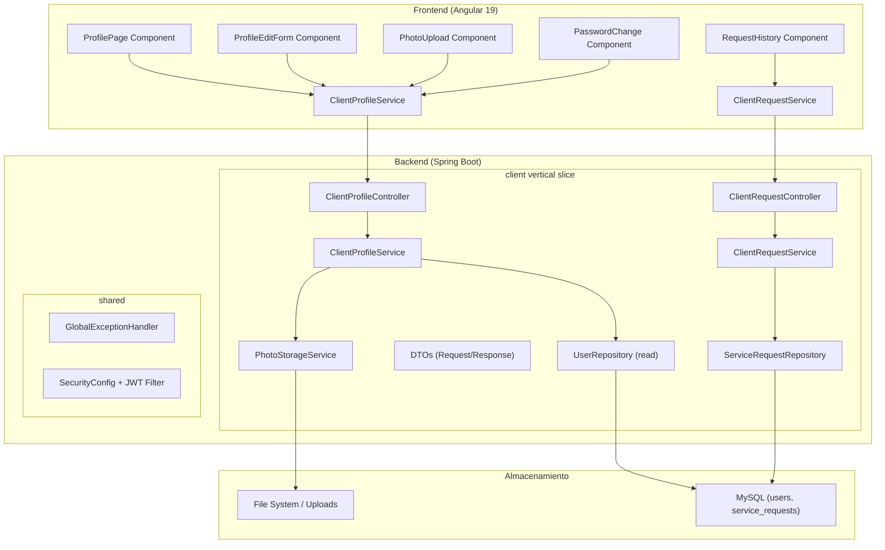

# Documento de Diseño — Perfil de Cliente

## Visión General

Este documento describe la arquitectura y el diseño técnico para la funcionalidad de perfil de cliente en ServiPy. Cubre cinco operaciones principales: consultar perfil, editar datos personales, cambiar foto de perfil, cambiar contraseña y consultar historial de solicitudes. Se implementa como un vertical slice independiente (`client`) en el backend y un feature module dedicado en el frontend Angular.

### Decisiones Clave

| Decisión | Justificación |
|----------|---------------|
| Vertical slice `client` separado del slice `user` | El slice `user` contiene la entidad base; `client` encapsula la lógica de negocio específica del rol CLIENT |
| Almacenamiento de fotos en sistema de archivos local con URL pública | Simplicidad para MVP; se puede migrar a S3/MinIO sin cambiar el contrato de API |
| Validación de MIME por magic bytes | Previene que se suban archivos renombrados con extensión falsa |
| jqwik para property-based tests | Ya incluido en el pom.xml del proyecto |
| Paginación con Spring Data `Pageable` | Consistente con el patrón existente en `ProfessionalCatalogController` |

---

## Arquitectura

### Diagrama de Componentes



### Flujo de Autenticación

Todos los endpoints del slice `client` requieren un JWT válido con rol `CLIENT`. El flujo es:

1. El frontend envía el header `Authorization: Bearer <token>` (gestionado por un interceptor HTTP).
2. El `JwtAuthenticationFilter` (del slice de autenticación) valida el token y carga el `SecurityContext`.
3. Los endpoints usan `@PreAuthorize("hasRole('CLIENT')")` o verificación programática del rol.
4. El ID del usuario se extrae del `SecurityContext` para aislar datos.

---

## Componentes e Interfaces

### Backend — Vertical Slice `client`

#### Estructura de Paquetes

```
py.com.servipy.client
├── application
│   ├── ClientProfileService.java
│   ├── ClientRequestService.java
│   └── dto
│       ├── ClientProfileResponse.java
│       ├── ClientProfileUpdateRequest.java
│       ├── PasswordChangeRequest.java
│       ├── PhotoUploadResponse.java
│       ├── ServiceRequestResponse.java
│       └── ServiceRequestPageResponse.java
├── domain
│   └── ServiceRequest.java
│   └── RequestStatus.java
└── infrastructure
    ├── persistence
    │   ├── ServiceRequestRepository.java
    │   └── ServiceRequestSpecification.java
    ├── storage
    │   └── LocalPhotoStorageService.java
    └── web
        ├── ClientProfileController.java
        └── ClientRequestController.java
```

#### Contratos de API

**GET /api/v1/client/profile**

```
Headers: Authorization: Bearer <token>
Response 200:
{
  "id": 1,
  "name": "Juan Pérez",
  "email": "juan@email.com",
  "phone": "+595 981 123456",
  "photoUrl": "https://servipy.com/uploads/clients/1/photo.jpg"
}
```

**PUT /api/v1/client/profile**

```
Headers: Authorization: Bearer <token>
Request Body:
{
  "name": "Juan Pérez Actualizado",
  "phone": "+595 981 654321"
}
Response 200:
{
  "id": 1,
  "name": "Juan Pérez Actualizado",
  "email": "juan@email.com",
  "phone": "+595 981 654321",
  "photoUrl": "https://servipy.com/uploads/clients/1/photo.jpg",
  "updatedAt": "2024-01-15T10:30:00Z"
}
```

**PUT /api/v1/client/profile/photo**

```
Headers: Authorization: Bearer <token>
Content-Type: multipart/form-data
Body: file=<archivo_imagen>
Response 200:
{
  "photoUrl": "https://servipy.com/uploads/clients/1/photo-uuid.webp"
}
```

**PUT /api/v1/client/profile/password**

```
Headers: Authorization: Bearer <token>
Request Body:
{
  "currentPassword": "OldPass123",
  "newPassword": "NewPass456"
}
Response 200:
{
  "message": "Contraseña actualizada exitosamente"
}
```

**GET /api/v1/client/requests?status=PENDING&page=0&size=20**

```
Headers: Authorization: Bearer <token>
Response 200:
{
  "content": [
    {
      "id": 42,
      "serviceName": "Plomería General",
      "professionalName": "Carlos López",
      "status": "PENDING",
      "createdAt": "2024-01-10T14:00:00Z",
      "updatedAt": "2024-01-10T14:00:00Z"
    }
  ],
  "totalElements": 1,
  "totalPages": 1,
  "currentPage": 0,
  "pageSize": 20
}
```

#### Interfaces de Servicio

```java
public interface ClientProfileService {
    ClientProfileResponse getProfile(Long userId);
    ClientProfileResponse updateProfile(Long userId, ClientProfileUpdateRequest request);
    PhotoUploadResponse uploadPhoto(Long userId, MultipartFile file);
    void changePassword(Long userId, PasswordChangeRequest request);
}

public interface PhotoStorageService {
    String store(Long userId, MultipartFile file);
}

public interface ClientRequestService {
    ServiceRequestPageResponse getRequests(Long userId, String status, int page, int size);
}
```

### Frontend — Feature Module `client`

#### Estructura de Componentes

```
src/app/features/client/
├── routes.ts
├── profile/
│   ├── profile-page.component.ts
│   ├── profile-edit-form.component.ts
│   ├── photo-upload.component.ts
│   └── password-change.component.ts
├── requests/
│   ├── request-history-page.component.ts
│   ├── request-list.component.ts
│   └── request-status-badge.component.ts
├── services/
│   ├── client-profile.service.ts
│   └── client-request.service.ts
└── models/
    ├── client-profile.model.ts
    └── service-request.model.ts
```

#### Routing

```typescript
export const CLIENT_ROUTES: Routes = [
  {
    path: '',
    canActivate: [authGuard],
    children: [
      { path: 'profile', component: ProfilePageComponent },
      { path: 'requests', component: RequestHistoryPageComponent },
      { path: '', redirectTo: 'profile', pathMatch: 'full' }
    ]
  }
];
```

#### Servicios

El `ClientProfileService` del frontend extiende el patrón de `ApiService` existente:

```typescript
@Injectable({ providedIn: 'root' })
export class ClientProfileService {
  private readonly api = inject(ApiService);

  getProfile(): Observable<ClientProfile> {
    return this.api.get<ClientProfile>('/client/profile');
  }

  updateProfile(data: ProfileUpdateRequest): Observable<ClientProfile> {
    return this.api.put<ClientProfile>('/client/profile', data);
  }

  uploadPhoto(file: File): Observable<PhotoUploadResponse> {
    // Usa HttpClient directamente para multipart/form-data
  }

  changePassword(data: PasswordChangeRequest): Observable<{ message: string }> {
    return this.api.put('/client/profile/password', data);
  }
}
```

---

## Modelos de Datos

### Entidad: User (existente, sin modificación)

| Campo | Tipo | Restricciones |
|-------|------|---------------|
| id | Long (PK) | AUTO_INCREMENT |
| name | VARCHAR(150) | NOT NULL |
| email | VARCHAR(255) | NOT NULL, UNIQUE |
| password_hash | VARCHAR(255) | NOT NULL |
| role | ENUM(CLIENT, PROFESSIONAL, ADMIN) | NOT NULL |
| active | BOOLEAN | NOT NULL |
| phone | VARCHAR(20) | NULLABLE — **nuevo campo a agregar** |
| photo_url | VARCHAR(500) | NULLABLE — **nuevo campo a agregar** |
| created_at | TIMESTAMP | NOT NULL |
| updated_at | TIMESTAMP | NOT NULL |

> **Nota de diseño:** Se agregan `phone` y `photo_url` directamente a la tabla `users` ya que son atributos del usuario sin importar el rol. No se crea una tabla separada `client_profiles` para evitar JOINs innecesarios en una consulta simple de perfil.

### Entidad: ServiceRequest (nueva)

| Campo | Tipo | Restricciones |
|-------|------|---------------|
| id | Long (PK) | AUTO_INCREMENT |
| client_id | Long (FK → users.id) | NOT NULL |
| professional_id | Long (FK → users.id) | NOT NULL |
| service_name | VARCHAR(100) | NOT NULL |
| professional_name | VARCHAR(150) | NOT NULL (desnormalizado) |
| status | ENUM(PENDING, ACCEPTED, REJECTED, COMPLETED, CANCELLED) | NOT NULL, DEFAULT 'PENDING' |
| created_at | TIMESTAMP | NOT NULL |
| updated_at | TIMESTAMP | NOT NULL |

### DTOs del Backend

```java
// Response
public record ClientProfileResponse(
    Long id,
    String name,
    String email,
    String phone,
    String photoUrl,
    Instant updatedAt
) {}

// Request para actualización
public record ClientProfileUpdateRequest(
    @NotBlank @Size(min = 2, max = 100) String name,
    @Pattern(regexp = "^[\\d\\s\\-+]*$") @Size(min = 7, max = 20) String phone
) {}

// Request para cambio de contraseña
public record PasswordChangeRequest(
    @NotBlank String currentPassword,
    @NotBlank @Size(min = 8, max = 72) String newPassword
) {}

// Response de foto
public record PhotoUploadResponse(String photoUrl) {}

// Response de solicitud
public record ServiceRequestResponse(
    Long id,
    String serviceName,
    String professionalName,
    String status,
    Instant createdAt,
    Instant updatedAt
) {}

// Response paginada
public record ServiceRequestPageResponse(
    List<ServiceRequestResponse> content,
    long totalElements,
    int totalPages,
    int currentPage,
    int pageSize
) {}
```

### Modelos del Frontend

```typescript
export interface ClientProfile {
  id: number;
  name: string;
  email: string;
  phone: string | null;
  photoUrl: string | null;
  updatedAt?: string;
}

export interface ProfileUpdateRequest {
  name: string;
  phone: string | null;
}

export interface PasswordChangeRequest {
  currentPassword: string;
  newPassword: string;
}

export interface ServiceRequest {
  id: number;
  serviceName: string;
  professionalName: string;
  status: 'PENDING' | 'ACCEPTED' | 'REJECTED' | 'COMPLETED' | 'CANCELLED';
  createdAt: string;
  updatedAt: string;
}

export interface PaginatedResponse<T> {
  content: T[];
  totalElements: number;
  totalPages: number;
  currentPage: number;
  pageSize: number;
}
```

### Migración Flyway

Se requiere una migración para agregar campos a `users` y crear la tabla `service_requests`:

```sql
-- V3__add_client_profile_fields.sql
ALTER TABLE users ADD COLUMN phone VARCHAR(20) NULL;
ALTER TABLE users ADD COLUMN photo_url VARCHAR(500) NULL;

CREATE TABLE service_requests (
    id BIGINT AUTO_INCREMENT PRIMARY KEY,
    client_id BIGINT NOT NULL,
    professional_id BIGINT NOT NULL,
    service_name VARCHAR(100) NOT NULL,
    professional_name VARCHAR(150) NOT NULL,
    status ENUM('PENDING','ACCEPTED','REJECTED','COMPLETED','CANCELLED') NOT NULL DEFAULT 'PENDING',
    created_at TIMESTAMP NOT NULL DEFAULT CURRENT_TIMESTAMP,
    updated_at TIMESTAMP NOT NULL DEFAULT CURRENT_TIMESTAMP ON UPDATE CURRENT_TIMESTAMP,
    CONSTRAINT fk_request_client FOREIGN KEY (client_id) REFERENCES users(id),
    CONSTRAINT fk_request_professional FOREIGN KEY (professional_id) REFERENCES users(id),
    INDEX idx_requests_client_status (client_id, status),
    INDEX idx_requests_client_created (client_id, created_at DESC)
);
```

---

## Propiedades de Corrección

*Una propiedad es una característica o comportamiento que debe cumplirse en todas las ejecuciones válidas del sistema — esencialmente, una declaración formal sobre lo que el sistema debe hacer. Las propiedades sirven como puente entre especificaciones legibles y garantías verificables por máquina.*

### Property 1: Round-trip de actualización de perfil

*Para cualquier* nombre válido (2-100 caracteres, no solo espacios) y teléfono válido (7-20 caracteres, solo dígitos/espacios/guiones/+), si se envía un PUT al endpoint de perfil y luego se consulta con GET, los valores devueltos de name y phone deben coincidir exactamente con los valores enviados.

**Validates: Requirements 2.1**

### Property 2: Rechazo de nombres inválidos

*Para cualquier* cadena que esté vacía, tenga menos de 2 caracteres o más de 100 caracteres (después de trimming), el endpoint de actualización de perfil debe responder con HTTP 400 y no modificar el perfil almacenado.

**Validates: Requirements 2.2**

### Property 3: Rechazo de teléfonos inválidos

*Para cualquier* cadena que tenga menos de 7 o más de 20 caracteres, o que contenga caracteres fuera del conjunto permitido (dígitos, espacios, guiones, +), el endpoint de actualización de perfil debe responder con HTTP 400 y no modificar el perfil almacenado.

**Validates: Requirements 2.3, 2.7**

### Property 4: Inmutabilidad de campos protegidos

*Para cualquier* solicitud PUT al endpoint de perfil que incluya valores para email, role o id en el cuerpo JSON, esos campos deben permanecer sin cambios en el perfil almacenado después de la operación (ya sea exitosa o rechazada).

**Validates: Requirements 2.6**

### Property 5: Validación de MIME por contenido real

*Para cualquier* archivo cuyo contenido real (magic bytes) no corresponda a JPEG, PNG o WebP, independientemente del Content-Type declarado en el header, el endpoint de upload de foto debe responder con HTTP 400.

**Validates: Requirements 3.2, 3.3**

### Property 6: Round-trip de contraseña

*Para cualquier* contraseña válida (8-72 caracteres, al menos una mayúscula, una minúscula y un dígito) diferente de la contraseña actual, si se ejecuta el cambio de contraseña exitosamente, la nueva contraseña debe poder verificarse contra el hash almacenado usando bcrypt.

**Validates: Requirements 4.1**

### Property 7: Rechazo de contraseñas con complejidad insuficiente

*Para cualquier* cadena de 8-72 caracteres que no contenga al menos una mayúscula, una minúscula y un dígito, el endpoint de cambio de contraseña debe responder con HTTP 400.

**Validates: Requirements 4.3, 4.8**

### Property 8: Contraseña nueva distinta a la actual

*Para cualquier* cadena de contraseña válida (cumple requisitos de longitud y complejidad) que sea idéntica a la contraseña actual, el endpoint de cambio de contraseña debe responder con HTTP 400.

**Validates: Requirements 4.9**

### Property 9: Ausencia de hash en respuestas

*Para cualquier* operación exitosa sobre los endpoints de perfil (GET, PUT perfil, PUT foto, PUT password), el cuerpo de la respuesta nunca debe contener el campo passwordHash ni ninguna cadena que coincida con un patrón de hash bcrypt.

**Validates: Requirements 4.7**

### Property 10: Aislamiento de solicitudes por cliente

*Para cualquier* par de clientes A y B con solicitudes registradas, cuando el cliente A consulta su historial, ninguna solicitud devuelta debe tener un client_id correspondiente al cliente B.

**Validates: Requirements 5.2**

### Property 11: Ordenamiento descendente por fecha

*Para cualquier* lista de solicitudes devuelta por el endpoint de historial, cada elemento en la posición i debe tener un createdAt mayor o igual al elemento en la posición i+1.

**Validates: Requirements 5.3**

### Property 12: Filtrado por estado correcto

*Para cualquier* valor válido de estado usado como parámetro de filtro, todas las solicitudes en la respuesta deben tener exactamente ese estado.

**Validates: Requirements 5.7**

### Property 13: Consistencia de paginación

*Para cualquier* conjunto de solicitudes de un cliente, la suma de elementos en todas las páginas debe ser igual a totalElements, y ninguna página debe contener más de pageSize elementos.

**Validates: Requirements 5.9**

---

## Manejo de Errores

### Estrategia General

Se extiende el `GlobalExceptionHandler` existente con nuevos exception handlers para los códigos de error específicos del slice `client`:

| Código | HTTP Status | Descripción |
|--------|-------------|-------------|
| `UNAUTHORIZED` | 401 | Token ausente, expirado o inválido |
| `FORBIDDEN` | 403 | Rol no autorizado para el endpoint |
| `NOT_FOUND` | 404 | No se encontró perfil para el usuario del token |
| `VALIDATION_ERROR` | 400 | Fallo de validación en campos del request |
| `INVALID_CURRENT_PASSWORD` | 400 | Contraseña actual incorrecta |
| `INVALID_FILE_TYPE` | 400 | Archivo con MIME no permitido |
| `FILE_TOO_LARGE` | 400 | Archivo supera 5 MB |
| `INTERNAL_ERROR` | 500 | Fallo en almacenamiento u operación interna |

### Excepciones Personalizadas

```java
public class InvalidCurrentPasswordException extends RuntimeException { ... }
public class InvalidFileTypeException extends RuntimeException { ... }
public class FileTooLargeException extends RuntimeException { ... }
public class PhotoStorageException extends RuntimeException { ... }
```

Cada excepción se captura en el `GlobalExceptionHandler` y se transforma al formato `ErrorResponse` estándar.

### Manejo en Frontend

- El `errorInterceptor` existente se extiende para manejar 401 (redirección a login) y extraer el `message` del `ErrorResponse`.
- Los componentes muestran notificaciones de error usando un servicio `NotificationService` compartido.
- Timeout de 15 segundos configurado a nivel de servicio con `timeout()` de RxJS.

---

## Estrategia de Testing

### Enfoque Dual

| Tipo | Herramienta | Propósito |
|------|-------------|-----------|
| Property-based tests | jqwik (Java) | Validar propiedades universales sobre validación, transformación de datos y aislamiento |
| Unit tests | JUnit 5 + Mockito | Casos específicos, edge cases, integración entre componentes |
| Integration tests | Spring Boot Test + H2 | Flujos completos endpoint-to-database |
| Component tests | Jasmine + Karma | Componentes Angular, formularios reactivos |

### Property-Based Tests (jqwik)

Se implementan las 13 propiedades de corrección definidas arriba. Configuración:

- Mínimo 100 iteraciones por propiedad (`@Property(tries = 100)`)
- Cada test referencia su propiedad de diseño con tag:
  ```java
  @Tag("Feature: customer-profile, Property 1: Round-trip de actualización de perfil")
  ```
- Generadores personalizados para:
  - Nombres válidos/inválidos (strings de distintas longitudes y composición)
  - Teléfonos válidos/inválidos (caracteres permitidos vs. prohibidos)
  - Contraseñas con/sin requisitos de complejidad
  - Archivos con magic bytes de distintos formatos

### Unit Tests (JUnit 5)

- Casos de ejemplo para autenticación/autorización (401, 403)
- Edge cases: perfil no encontrado (404), body vacío, archivo 0 bytes
- Lógica de mapeo DTO → response
- Validación de phone como null/ausente

### Integration Tests

- Flujo completo: crear usuario → consultar perfil → editar → verificar
- Upload de foto con storage mockeado
- Paginación con dataset de >50 solicitudes
- Invalidación de tokens tras cambio de contraseña

### Frontend Tests

- Component tests para formularios reactivos (validaciones síncronas)
- Test de servicio con HttpClientTestingModule
- Test de guard de autenticación
- Test de estados de carga y error en componentes
