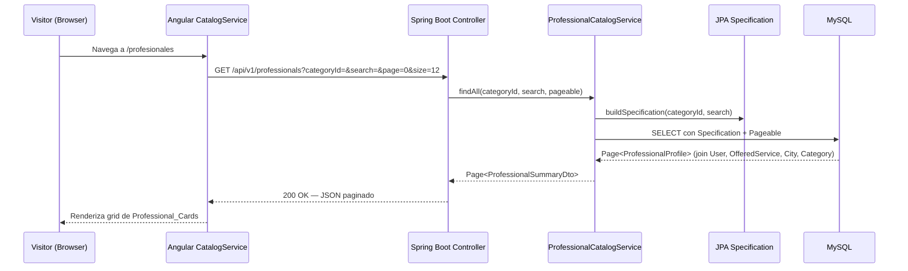
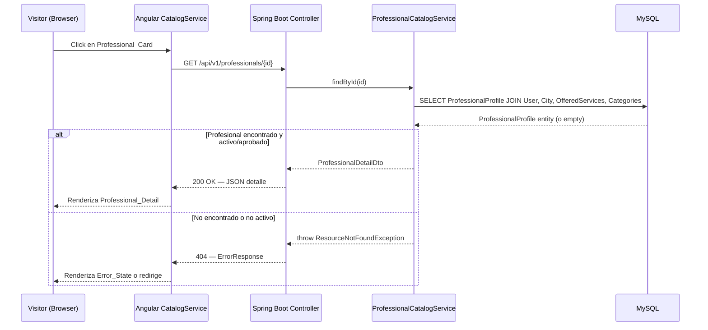

# Design Document — Catálogo Público de Profesionales

## Overview

Este diseño cubre el módulo de catálogo público de ServiPy: los endpoints REST que exponen datos de profesionales/categorías sin autenticación, y los componentes Angular que renderizan el listado, filtrado, búsqueda y detalle. El diseño sigue la arquitectura vertical (vertical slice) existente en el backend y el patrón de lazy-loaded features en el frontend.

**Decisiones clave:**
- Spring Data JPA Specifications para filtrado dinámico (categoryId + search combinables sin IF/ELSE anidados).
- `Page<T>` / `Pageable` para paginación con cap de tamaño máximo 50.
- Angular signals para estado reactivo en componentes del catálogo.
- Reutilización de `ApiService`, `ErrorResponse` y `errorInterceptor` existentes.

---

## Architecture

### Diagrama de secuencia — Listado de profesionales



### Diagrama de secuencia — Detalle de profesional



---

## Components and Interfaces

### Backend — Estructura vertical propuesta

```
backend/src/main/java/py/com/servipy/
├── professional/
│   ├── domain/
│   │   ├── ProfessionalProfile.java          # JPA Entity
│   │   ├── OfferedService.java               # JPA Entity
│   │   ├── ApprovalStatus.java               # Enum: PENDING, APPROVED, REJECTED
│   │   └── Availability.java                 # Enum: PRESENCIAL, VIRTUAL, AMBOS
│   ├── application/
│   │   ├── ProfessionalCatalogService.java   # Caso de uso: listado + detalle
│   │   ├── dto/
│   │   │   ├── ProfessionalSummaryDto.java   # DTO para listado
│   │   │   ├── ProfessionalDetailDto.java    # DTO para detalle
│   │   │   └── OfferedServiceDto.java        # DTO servicio dentro de detalle
│   │   └── spec/
│   │       └── ProfessionalSpecification.java # JPA Specification builder
│   └── infrastructure/
│       ├── persistence/
│       │   ├── ProfessionalProfileRepository.java
│       │   └── OfferedServiceRepository.java
│       └── web/
│           └── ProfessionalCatalogController.java
├── category/
│   ├── domain/
│   │   └── Category.java                    # JPA Entity
│   ├── application/
│   │   ├── CategoryService.java             # Caso de uso: listar categorías activas
│   │   └── dto/
│   │       └── CategoryDto.java             # DTO respuesta
│   └── infrastructure/
│       ├── persistence/
│       │   └── CategoryRepository.java
│       └── web/
│           └── CategoryController.java
├── city/
│   └── domain/
│       └── City.java                        # JPA Entity (solo se usa en joins)
├── country/
│   └── domain/
│       └── Country.java                     # JPA Entity (solo se usa en joins)
├── user/
│   └── domain/
│       └── User.java                        # JPA Entity (solo se usa en joins)
└── shared/
    ├── config/
    │   └── SecurityConfig.java              # MODIFICAR: agregar whitelist catálogo
    └── exception/
        ├── ErrorResponse.java               # Existente
        ├── GlobalExceptionHandler.java      # MODIFICAR: agregar handler ResourceNotFoundException
        └── ResourceNotFoundException.java   # NUEVO: exception para 404
```

### Frontend — Estructura de componentes

```
frontend/src/app/
├── features/public/
│   ├── catalog/
│   │   ├── catalog.routes.ts                # Rutas del catálogo
│   │   ├── catalog-list/
│   │   │   ├── catalog-list.component.ts
│   │   │   ├── catalog-list.component.html
│   │   │   └── catalog-list.component.spec.ts
│   │   ├── catalog-detail/
│   │   │   ├── catalog-detail.component.ts
│   │   │   ├── catalog-detail.component.html
│   │   │   └── catalog-detail.component.spec.ts
│   │   ├── components/
│   │   │   ├── professional-card/
│   │   │   │   ├── professional-card.component.ts
│   │   │   │   ├── professional-card.component.html
│   │   │   │   └── professional-card.component.spec.ts
│   │   │   ├── category-filter/
│   │   │   │   ├── category-filter.component.ts
│   │   │   │   ├── category-filter.component.html
│   │   │   │   └── category-filter.component.spec.ts
│   │   │   ├── search-bar/
│   │   │   │   ├── search-bar.component.ts
│   │   │   │   ├── search-bar.component.html
│   │   │   │   └── search-bar.component.spec.ts
│   │   │   ├── empty-state/
│   │   │   │   ├── empty-state.component.ts
│   │   │   │   └── empty-state.component.html
│   │   │   ├── loading-state/
│   │   │   │   ├── loading-state.component.ts
│   │   │   │   └── loading-state.component.html
│   │   │   └── error-state/
│   │   │       ├── error-state.component.ts
│   │   │       └── error-state.component.html
│   │   └── services/
│   │       ├── catalog.service.ts
│   │       └── catalog.service.spec.ts
│   └── routes.ts                            # MODIFICAR: agregar ruta catalog
├── shared/models/
│   ├── api-response.model.ts                # Existente
│   ├── professional.model.ts                # NUEVO: interfaces Professional
│   ├── category.model.ts                    # NUEVO: interface Category
│   └── paginated-response.model.ts          # NUEVO: interface genérica Page<T>
```

---

## Data Models

### Entidades JPA

#### User (entity — solo lectura para este módulo)

```java
@Entity
@Table(name = "users")
public class User {
    @Id @GeneratedValue(strategy = GenerationType.IDENTITY)
    private Long id;
    private String name;
    private String email;
    private String passwordHash;
    @Enumerated(EnumType.STRING)
    private Role role;
    private Boolean active;
    private Instant createdAt;
    private Instant updatedAt;
}
```

#### ProfessionalProfile

```java
@Entity
@Table(name = "professional_profiles")
public class ProfessionalProfile {
    @Id @GeneratedValue(strategy = GenerationType.IDENTITY)
    private Long id;

    @OneToOne(fetch = FetchType.LAZY)
    @JoinColumn(name = "user_id")
    private User user;

    private String photoUrl;
    private String phone;
    private String whatsapp;

    @Column(columnDefinition = "TEXT")
    private String description;

    @ManyToOne(fetch = FetchType.LAZY)
    @JoinColumn(name = "city_id")
    private City city;

    @Enumerated(EnumType.STRING)
    private ApprovalStatus approvalStatus;

    @Enumerated(EnumType.STRING)
    private Availability availability;

    @OneToMany(mappedBy = "professional", fetch = FetchType.LAZY)
    private List<OfferedService> offeredServices;

    private Instant createdAt;
    private Instant updatedAt;
}
```

#### OfferedService

```java
@Entity
@Table(name = "offered_services")
public class OfferedService {
    @Id @GeneratedValue(strategy = GenerationType.IDENTITY)
    private Long id;

    @ManyToOne(fetch = FetchType.LAZY)
    @JoinColumn(name = "professional_id")
    private ProfessionalProfile professional;

    @ManyToOne(fetch = FetchType.LAZY)
    @JoinColumn(name = "category_id")
    private Category category;

    private String name;

    @Column(columnDefinition = "TEXT")
    private String description;

    private BigDecimal price;
    private String currency;
    private Boolean active;
}
```

#### Category

```java
@Entity
@Table(name = "categories")
public class Category {
    @Id @GeneratedValue(strategy = GenerationType.IDENTITY)
    private Long id;
    private String name;
    private String icon;
    private String description;
    private Boolean active;
}
```

#### City

```java
@Entity
@Table(name = "cities")
public class City {
    @Id @GeneratedValue(strategy = GenerationType.IDENTITY)
    private Long id;

    @ManyToOne(fetch = FetchType.LAZY)
    @JoinColumn(name = "country_id")
    private Country country;

    private String name;
    private Double latitude;
    private Double longitude;
}
```

#### Country

```java
@Entity
@Table(name = "countries")
public class Country {
    @Id @GeneratedValue(strategy = GenerationType.IDENTITY)
    private Long id;
    private String name;
    private String code;
    private String defaultCurrency;
}
```

### Enums

```java
public enum ApprovalStatus { PENDING, APPROVED, REJECTED }
public enum Availability { PRESENCIAL, VIRTUAL, AMBOS }
public enum Role { CLIENT, PROFESSIONAL, ADMIN }
```

### DTOs de respuesta

#### ProfessionalSummaryDto (listado)

```java
public record ProfessionalSummaryDto(
    Long id,
    String name,
    String professionalTitle,  // Nombre del primer OfferedService activo
    String categoryName,       // Categoría del primer OfferedService activo
    String description,        // Truncado a 150 chars
    String cityName,
    BigDecimal referencePrice, // Precio más bajo entre OfferedServices activos
    String availability,       // PRESENCIAL | VIRTUAL | AMBOS
    String photoUrl            // Nullable
) {}
```

#### ProfessionalDetailDto (detalle)

```java
public record ProfessionalDetailDto(
    Long id,
    String name,
    String photoUrl,           // Nullable
    String phone,
    String whatsapp,           // Nullable
    String description,        // Completa, sin truncar
    String cityName,
    String availability,
    List<OfferedServiceDto> services
) {}
```

#### OfferedServiceDto

```java
public record OfferedServiceDto(
    Long id,
    String name,
    String description,
    BigDecimal price,
    String currency,
    String categoryName
) {}
```

#### CategoryDto

```java
public record CategoryDto(
    Long id,
    String name,
    String icon,
    String description
) {}
```

### Modelos TypeScript (Frontend)

```typescript
// shared/models/professional.model.ts
export interface ProfessionalSummary {
  id: number;
  name: string;
  professionalTitle: string;
  categoryName: string;
  description: string;
  cityName: string;
  referencePrice: number;
  availability: string;
  photoUrl: string | null;
}

export interface ProfessionalDetail {
  id: number;
  name: string;
  photoUrl: string | null;
  phone: string;
  whatsapp: string | null;
  description: string;
  cityName: string;
  availability: string;
  services: OfferedServiceItem[];
}

export interface OfferedServiceItem {
  id: number;
  name: string;
  description: string;
  price: number;
  currency: string;
  categoryName: string;
}
```

```typescript
// shared/models/category.model.ts
export interface Category {
  id: number;
  name: string;
  icon: string;
  description: string;
}
```

```typescript
// shared/models/paginated-response.model.ts
export interface PaginatedResponse<T> {
  content: T[];
  totalElements: number;
  totalPages: number;
  number: number;  // página actual (0-indexed)
  size: number;    // tamaño de página
}
```

### Migración Flyway — V2__catalog_tables.sql

```sql
CREATE TABLE countries (
    id BIGINT AUTO_INCREMENT PRIMARY KEY,
    name VARCHAR(100) NOT NULL,
    code VARCHAR(3) NOT NULL UNIQUE,
    default_currency VARCHAR(3) NOT NULL
) ENGINE=InnoDB DEFAULT CHARSET=utf8mb4;

CREATE TABLE cities (
    id BIGINT AUTO_INCREMENT PRIMARY KEY,
    country_id BIGINT NOT NULL,
    name VARCHAR(100) NOT NULL,
    latitude DOUBLE,
    longitude DOUBLE,
    CONSTRAINT fk_city_country FOREIGN KEY (country_id) REFERENCES countries(id)
) ENGINE=InnoDB DEFAULT CHARSET=utf8mb4;

CREATE TABLE categories (
    id BIGINT AUTO_INCREMENT PRIMARY KEY,
    name VARCHAR(100) NOT NULL,
    icon VARCHAR(50),
    description VARCHAR(255),
    active BOOLEAN NOT NULL DEFAULT TRUE
) ENGINE=InnoDB DEFAULT CHARSET=utf8mb4;

CREATE TABLE users (
    id BIGINT AUTO_INCREMENT PRIMARY KEY,
    name VARCHAR(150) NOT NULL,
    email VARCHAR(255) NOT NULL UNIQUE,
    password_hash VARCHAR(255) NOT NULL,
    role ENUM('CLIENT','PROFESSIONAL','ADMIN') NOT NULL,
    active BOOLEAN NOT NULL DEFAULT TRUE,
    created_at TIMESTAMP NOT NULL DEFAULT CURRENT_TIMESTAMP,
    updated_at TIMESTAMP NOT NULL DEFAULT CURRENT_TIMESTAMP ON UPDATE CURRENT_TIMESTAMP
) ENGINE=InnoDB DEFAULT CHARSET=utf8mb4;

CREATE TABLE professional_profiles (
    id BIGINT AUTO_INCREMENT PRIMARY KEY,
    user_id BIGINT NOT NULL UNIQUE,
    photo_url VARCHAR(500),
    phone VARCHAR(20),
    whatsapp VARCHAR(20),
    description TEXT,
    city_id BIGINT,
    approval_status ENUM('PENDING','APPROVED','REJECTED') NOT NULL DEFAULT 'PENDING',
    availability ENUM('PRESENCIAL','VIRTUAL','AMBOS') NOT NULL DEFAULT 'PRESENCIAL',
    created_at TIMESTAMP NOT NULL DEFAULT CURRENT_TIMESTAMP,
    updated_at TIMESTAMP NOT NULL DEFAULT CURRENT_TIMESTAMP ON UPDATE CURRENT_TIMESTAMP,
    CONSTRAINT fk_profile_user FOREIGN KEY (user_id) REFERENCES users(id),
    CONSTRAINT fk_profile_city FOREIGN KEY (city_id) REFERENCES cities(id)
) ENGINE=InnoDB DEFAULT CHARSET=utf8mb4;

CREATE TABLE offered_services (
    id BIGINT AUTO_INCREMENT PRIMARY KEY,
    professional_id BIGINT NOT NULL,
    category_id BIGINT NOT NULL,
    name VARCHAR(150) NOT NULL,
    description TEXT,
    price DECIMAL(12,2) NOT NULL,
    currency VARCHAR(3) NOT NULL DEFAULT 'PYG',
    active BOOLEAN NOT NULL DEFAULT TRUE,
    CONSTRAINT fk_service_professional FOREIGN KEY (professional_id) REFERENCES professional_profiles(id),
    CONSTRAINT fk_service_category FOREIGN KEY (category_id) REFERENCES categories(id)
) ENGINE=InnoDB DEFAULT CHARSET=utf8mb4;

-- Índices para búsqueda y filtrado
CREATE INDEX idx_profiles_approval ON professional_profiles(approval_status);
CREATE INDEX idx_services_professional ON offered_services(professional_id);
CREATE INDEX idx_services_category ON offered_services(category_id);
CREATE INDEX idx_services_active ON offered_services(active);
CREATE INDEX idx_users_active ON users(active);
```

---

## Repositories

### ProfessionalProfileRepository

```java
public interface ProfessionalProfileRepository extends JpaRepository<ProfessionalProfile, Long>,
        JpaSpecificationExecutor<ProfessionalProfile> {

    /**
     * Busca un perfil aprobado con usuario activo y al menos un servicio activo.
     * Usa fetch joins para evitar N+1.
     */
    @Query("""
        SELECT DISTINCT p FROM ProfessionalProfile p
        JOIN FETCH p.user u
        LEFT JOIN FETCH p.city c
        LEFT JOIN FETCH p.offeredServices os
        LEFT JOIN FETCH os.category
        WHERE p.id = :id
          AND p.approvalStatus = 'APPROVED'
          AND u.active = true
          AND os.active = true
    """)
    Optional<ProfessionalProfile> findActiveById(@Param("id") Long id);
}
```

### CategoryRepository

```java
public interface CategoryRepository extends JpaRepository<Category, Long> {

    List<Category> findByActiveTrueOrderByNameAsc();

    boolean existsById(Long id);
}
```

### OfferedServiceRepository

```java
public interface OfferedServiceRepository extends JpaRepository<OfferedService, Long> {
    // No se necesitan queries custom para el catálogo; se accede vía join en Specification.
}
```

---

## Use Cases / Services

### ProfessionalCatalogService

```java
@Service
@Transactional(readOnly = true)
public class ProfessionalCatalogService {

    private final ProfessionalProfileRepository profileRepository;

    public ProfessionalCatalogService(ProfessionalProfileRepository profileRepository) {
        this.profileRepository = profileRepository;
    }

    /**
     * Lista profesionales activos y aprobados con filtrado dinámico.
     * @param categoryId filtro por categoría (nullable)
     * @param search búsqueda textual (nullable o vacío → se ignora)
     * @param pageable paginación (size capped a 50 en controller)
     */
    public Page<ProfessionalSummaryDto> findAll(Long categoryId, String search, Pageable pageable) {
        Specification<ProfessionalProfile> spec = ProfessionalSpecification.build(categoryId, search);
        Page<ProfessionalProfile> page = profileRepository.findAll(spec, pageable);
        return page.map(this::toSummaryDto);
    }

    /**
     * Detalle de un profesional activo/aprobado por id.
     * @throws ResourceNotFoundException si no existe o no cumple condiciones.
     */
    public ProfessionalDetailDto findById(Long id) {
        ProfessionalProfile profile = profileRepository.findActiveById(id)
            .orElseThrow(() -> new ResourceNotFoundException("Profesional no encontrado"));
        return toDetailDto(profile);
    }

    private ProfessionalSummaryDto toSummaryDto(ProfessionalProfile p) {
        List<OfferedService> activeServices = p.getOfferedServices().stream()
            .filter(OfferedService::getActive)
            .toList();

        OfferedService first = activeServices.isEmpty() ? null : activeServices.get(0);

        return new ProfessionalSummaryDto(
            p.getId(),
            p.getUser().getName(),
            first != null ? first.getName() : null,
            first != null ? first.getCategory().getName() : null,
            truncate(p.getDescription(), 150),
            p.getCity() != null ? p.getCity().getName() : null,
            activeServices.stream()
                .map(OfferedService::getPrice)
                .min(BigDecimal::compareTo)
                .orElse(null),
            p.getAvailability().name(),
            p.getPhotoUrl()
        );
    }

    private ProfessionalDetailDto toDetailDto(ProfessionalProfile p) {
        List<OfferedServiceDto> services = p.getOfferedServices().stream()
            .filter(OfferedService::getActive)
            .map(os -> new OfferedServiceDto(
                os.getId(), os.getName(), os.getDescription(),
                os.getPrice(), os.getCurrency(), os.getCategory().getName()
            ))
            .toList();

        return new ProfessionalDetailDto(
            p.getId(),
            p.getUser().getName(),
            p.getPhotoUrl(),
            p.getPhone(),
            p.getWhatsapp(),
            p.getDescription(),
            p.getCity() != null ? p.getCity().getName() : null,
            p.getAvailability().name(),
            services
        );
    }

    private String truncate(String text, int maxLen) {
        if (text == null || text.length() <= maxLen) return text;
        return text.substring(0, maxLen - 3) + "...";
    }
}
```

### ProfessionalSpecification

```java
public final class ProfessionalSpecification {

    private ProfessionalSpecification() {}

    public static Specification<ProfessionalProfile> build(Long categoryId, String search) {
        return Specification.where(isApproved())
            .and(userIsActive())
            .and(hasActiveServices())
            .and(inCategory(categoryId))
            .and(matchesSearch(search));
    }

    private static Specification<ProfessionalProfile> isApproved() {
        return (root, query, cb) ->
            cb.equal(root.get("approvalStatus"), ApprovalStatus.APPROVED);
    }

    private static Specification<ProfessionalProfile> userIsActive() {
        return (root, query, cb) -> {
            Join<ProfessionalProfile, User> user = root.join("user");
            return cb.isTrue(user.get("active"));
        };
    }

    private static Specification<ProfessionalProfile> hasActiveServices() {
        return (root, query, cb) -> {
            Subquery<Long> subquery = query.subquery(Long.class);
            Root<OfferedService> service = subquery.from(OfferedService.class);
            subquery.select(service.get("id"))
                .where(
                    cb.equal(service.get("professional"), root),
                    cb.isTrue(service.get("active"))
                );
            return cb.exists(subquery);
        };
    }

    private static Specification<ProfessionalProfile> inCategory(Long categoryId) {
        if (categoryId == null) return null; // ignored by Specification.where()
        return (root, query, cb) -> {
            Subquery<Long> subquery = query.subquery(Long.class);
            Root<OfferedService> service = subquery.from(OfferedService.class);
            subquery.select(service.get("id"))
                .where(
                    cb.equal(service.get("professional"), root),
                    cb.isTrue(service.get("active")),
                    cb.equal(service.get("category").get("id"), categoryId)
                );
            return cb.exists(subquery);
        };
    }

    private static Specification<ProfessionalProfile> matchesSearch(String search) {
        if (search == null || search.isBlank()) return null;
        return (root, query, cb) -> {
            String pattern = "%" + search.trim().toLowerCase() + "%";
            Join<ProfessionalProfile, User> user = root.join("user");
            Predicate nameLike = cb.like(cb.lower(user.get("name")), pattern);
            Predicate descLike = cb.like(cb.lower(root.get("description")), pattern);
            // Búsqueda en nombres de servicios activos
            Subquery<Long> subquery = query.subquery(Long.class);
            Root<OfferedService> service = subquery.from(OfferedService.class);
            subquery.select(service.get("id"))
                .where(
                    cb.equal(service.get("professional"), root),
                    cb.isTrue(service.get("active")),
                    cb.like(cb.lower(service.get("name")), pattern)
                );
            Predicate serviceLike = cb.exists(subquery);
            return cb.or(nameLike, descLike, serviceLike);
        };
    }
}
```

### CategoryService

```java
@Service
@Transactional(readOnly = true)
public class CategoryService {

    private final CategoryRepository categoryRepository;

    public CategoryService(CategoryRepository categoryRepository) {
        this.categoryRepository = categoryRepository;
    }

    public List<CategoryDto> findAllActive() {
        return categoryRepository.findByActiveTrueOrderByNameAsc().stream()
            .map(c -> new CategoryDto(c.getId(), c.getName(), c.getIcon(), c.getDescription()))
            .toList();
    }
}
```

---

## Endpoints

### ProfessionalCatalogController

```java
@RestController
@RequestMapping("/api/v1/professionals")
public class ProfessionalCatalogController {

    private final ProfessionalCatalogService catalogService;

    public ProfessionalCatalogController(ProfessionalCatalogService catalogService) {
        this.catalogService = catalogService;
    }

    /**
     * GET /api/v1/professionals?categoryId=&search=&page=0&size=12
     * Público — sin autenticación.
     */
    @GetMapping
    public ResponseEntity<Page<ProfessionalSummaryDto>> list(
            @RequestParam(required = false) Long categoryId,
            @RequestParam(required = false) String search,
            @RequestParam(defaultValue = "0") int page,
            @RequestParam(defaultValue = "12") int size) {

        // Cap size a 50
        int cappedSize = Math.min(size < 1 ? 12 : size, 50);
        Pageable pageable = PageRequest.of(page, cappedSize, Sort.by("user.name").ascending());

        Page<ProfessionalSummaryDto> result = catalogService.findAll(categoryId, search, pageable);
        return ResponseEntity.ok(result);
    }

    /**
     * GET /api/v1/professionals/{id}
     * Público — sin autenticación.
     */
    @GetMapping("/{id}")
    public ResponseEntity<ProfessionalDetailDto> detail(@PathVariable Long id) {
        ProfessionalDetailDto dto = catalogService.findById(id);
        return ResponseEntity.ok(dto);
    }
}
```

### CategoryController

```java
@RestController
@RequestMapping("/api/v1/categories")
public class CategoryController {

    private final CategoryService categoryService;

    public CategoryController(CategoryService categoryService) {
        this.categoryService = categoryService;
    }

    /**
     * GET /api/v1/categories
     * Público — sin autenticación.
     */
    @GetMapping
    public ResponseEntity<List<CategoryDto>> list() {
        return ResponseEntity.ok(categoryService.findAllActive());
    }
}
```

### Parámetros de búsqueda

| Parámetro    | Tipo    | Default | Validación                           | Descripción                                   |
|-------------|---------|---------|--------------------------------------|-----------------------------------------------|
| `categoryId`| Long    | null    | Positivo; 400 si no numérico         | Filtra por categoría de servicio              |
| `search`    | String  | null    | 1-100 chars no-whitespace; ignorado si vacío | Búsqueda textual en nombre/desc/servicio |
| `page`      | int     | 0       | >= 0                                 | Número de página (0-indexed)                  |
| `size`      | int     | 12      | 1-50 (capped at 50)                  | Tamaño de página                              |

### Respuestas y errores

| Endpoint                      | Status | Cuerpo                         | Condición                                |
|------------------------------|--------|--------------------------------|------------------------------------------|
| GET /professionals           | 200    | Page<ProfessionalSummaryDto>   | Siempre (puede estar vacío)              |
| GET /professionals           | 400    | ErrorResponse                  | categoryId no numérico o negativo        |
| GET /professionals/{id}      | 200    | ProfessionalDetailDto          | Profesional activo encontrado            |
| GET /professionals/{id}      | 400    | ErrorResponse                  | id no numérico                           |
| GET /professionals/{id}      | 404    | ErrorResponse                  | No existe o no es Active_Professional    |
| GET /categories              | 200    | List<CategoryDto>              | Siempre (puede estar vacío)             |

### Modificación a SecurityConfig

```java
.authorizeHttpRequests(auth -> auth
    .requestMatchers("/api/v1/health").permitAll()
    .requestMatchers("/actuator/health").permitAll()
    .requestMatchers(HttpMethod.GET, "/api/v1/professionals/**").permitAll()
    .requestMatchers(HttpMethod.GET, "/api/v1/categories").permitAll()
    .anyRequest().authenticated()
)
```

---

## Angular — Servicio HTTP y Componentes

### CatalogService

```typescript
// features/public/catalog/services/catalog.service.ts
import { Injectable, inject } from '@angular/core';
import { Observable } from 'rxjs';
import { ApiService } from '../../../../core/http/api.service';
import { PaginatedResponse } from '../../../../shared/models/paginated-response.model';
import { ProfessionalSummary, ProfessionalDetail } from '../../../../shared/models/professional.model';
import { Category } from '../../../../shared/models/category.model';

export interface CatalogSearchParams {
  categoryId?: number;
  search?: string;
  page?: number;
  size?: number;
}

@Injectable({ providedIn: 'root' })
export class CatalogService {
  private readonly api = inject(ApiService);

  getProfessionals(params: CatalogSearchParams = {}): Observable<PaginatedResponse<ProfessionalSummary>> {
    const queryParts: string[] = [];
    if (params.categoryId) queryParts.push(`categoryId=${params.categoryId}`);
    if (params.search?.trim()) queryParts.push(`search=${encodeURIComponent(params.search.trim())}`);
    queryParts.push(`page=${params.page ?? 0}`);
    queryParts.push(`size=${params.size ?? 12}`);
    const query = queryParts.join('&');
    return this.api.get<PaginatedResponse<ProfessionalSummary>>(`/professionals?${query}`);
  }

  getProfessionalById(id: number): Observable<ProfessionalDetail> {
    return this.api.get<ProfessionalDetail>(`/professionals/${id}`);
  }

  getCategories(): Observable<Category[]> {
    return this.api.get<Category[]>('/categories');
  }
}
```

### Rutas del catálogo

```typescript
// features/public/catalog/catalog.routes.ts
import { Routes } from '@angular/router';

export const CATALOG_ROUTES: Routes = [
  {
    path: '',
    loadComponent: () =>
      import('./catalog-list/catalog-list.component').then(m => m.CatalogListComponent),
  },
  {
    path: ':id',
    loadComponent: () =>
      import('./catalog-detail/catalog-detail.component').then(m => m.CatalogDetailComponent),
  },
];
```

### Modificación a PUBLIC_ROUTES

```typescript
// features/public/routes.ts
import { Routes } from '@angular/router';
import { HomeComponent } from './home/home.component';

export const PUBLIC_ROUTES: Routes = [
  { path: '', component: HomeComponent },
  {
    path: 'profesionales',
    loadChildren: () =>
      import('./catalog/catalog.routes').then(m => m.CATALOG_ROUTES),
  },
];
```

### Estados de interfaz

El componente `CatalogListComponent` gestiona tres estados mutuamente excluyentes:

```typescript
type CatalogState = 'loading' | 'loaded' | 'error';
```

| Estado    | Componente mostrado       | Condición                                           |
|-----------|---------------------------|-----------------------------------------------------|
| loading   | `<app-loading-state>`     | Mientras HTTP está en progreso                      |
| loaded    | Grid de cards O empty-state | HTTP completado; decide según content.length      |
| error     | `<app-error-state>`       | HTTP falló (network o status >= 500)               |

Lógica del empty-state:
- Si `content.length === 0` y NO hay filtros activos → mensaje genérico "No hay profesionales disponibles en este momento."
- Si `content.length === 0` y HAY filtros activos → mensaje "No se encontraron profesionales con los criterios seleccionados" + botón "Limpiar filtros".

---

## Correctness Properties

*A property is a characteristic or behavior that should hold true across all valid executions of a system — essentially, a formal statement about what the system should do. Properties serve as the bridge between human-readable specifications and machine-verifiable correctness guarantees.*

### Property 1: Visibility filter

*For any* set of professionals in the database with varying `user.active`, `approvalStatus`, and `offeredService.active` states, the catalog listing SHALL return only professionals where ALL THREE conditions hold: user is active, profile is APPROVED, and at least one offered service is active. No professional failing any condition SHALL appear in any page of results.

**Validates: Requirements 1.1**

### Property 2: Summary DTO correctness

*For any* valid ProfessionalProfile entity with active offered services, the summary mapping SHALL produce a DTO where: (a) `description` length is at most 150 characters (truncated with "..." if original exceeds 150), (b) `referencePrice` equals the minimum price among all active offered services, and (c) `professionalTitle` equals the name of the first active offered service.

**Validates: Requirements 1.2**

### Property 3: Page size capping

*For any* positive integer `size` provided as query parameter, the effective page size used in the query SHALL be `min(size, 50)`. For any `size` less than 1, the effective page size SHALL default to 12.

**Validates: Requirements 1.6**

### Property 4: Sort order invariant

*For any* page of results returned by the catalog listing endpoint, the professional names in the `content` array SHALL be in ascending alphabetical order (case-insensitive).

**Validates: Requirements 1.7**

### Property 5: Category filter correctness

*For any* valid `categoryId` and any result in the filtered listing, that professional SHALL have at least one active `OfferedService` whose `category.id` equals the provided `categoryId`. No professional without an active service in that category SHALL appear in the results.

**Validates: Requirements 2.1**

### Property 6: Invalid categoryId rejection

*For any* `categoryId` value that is not a positive integer (zero, negative numbers, non-numeric strings), the API SHALL respond with HTTP 400 and a body conforming to the `ErrorResponse` structure.

**Validates: Requirements 2.3**

### Property 7: Active categories only

*For any* response from `GET /api/v1/categories`, every category in the returned list SHALL have `active = true`. No category with `active = false` SHALL appear in the response.

**Validates: Requirements 2.4**

### Property 8: Search filter correctness

*For any* non-blank search term of 1-100 characters, every professional in the search results SHALL satisfy at least one of: (a) `user.name` contains the term (case-insensitive), (b) `professionalProfile.description` contains the term (case-insensitive), or (c) at least one active `OfferedService.name` contains the term (case-insensitive).

**Validates: Requirements 3.1**

### Property 9: Whitespace search normalization

*For any* search parameter consisting entirely of whitespace characters (spaces, tabs, newlines) or that is empty, the API SHALL return the same results as if the `search` parameter were not provided at all.

**Validates: Requirements 3.4**

### Property 10: Non-active professional detail returns 404

*For any* id that corresponds to a professional who does NOT meet all Active_Professional conditions (user.active AND approvalStatus=APPROVED AND has active service), `GET /api/v1/professionals/{id}` SHALL return HTTP 404 with an `ErrorResponse` body.

**Validates: Requirements 4.2**

### Property 11: UI state mutual exclusion

*For any* state of the catalog list component at any point in time, exactly ONE of the following SHALL be displayed: Loading_State, content grid (with or without Empty_State), or Error_State. No two of these states SHALL be visible simultaneously.

**Validates: Requirements 5.3, 6.1, 6.4**

---

## Error Handling

### Excepciones del backend

| Excepción                     | HTTP Status | Código error            | Mensaje                                        |
|------------------------------|-------------|-------------------------|------------------------------------------------|
| `ResourceNotFoundException`  | 404         | `PROFESSIONAL_NOT_FOUND`| "El profesional solicitado no fue encontrado"  |
| `MethodArgumentTypeMismatchException` | 400 | `INVALID_PARAMETER`     | "El parámetro '{param}' no es válido"         |
| `ConstraintViolationException` | 400       | `VALIDATION_ERROR`      | "Parámetro de búsqueda inválido"              |
| `Exception` (genérica)       | 500         | `INTERNAL_ERROR`        | "Ha ocurrido un error interno del servidor"    |

### ResourceNotFoundException (nueva)

```java
package py.com.servipy.shared.exception;

public class ResourceNotFoundException extends RuntimeException {
    public ResourceNotFoundException(String message) {
        super(message);
    }
}
```

### Handler adicional en GlobalExceptionHandler

```java
@ExceptionHandler(ResourceNotFoundException.class)
public ResponseEntity<ErrorResponse> handleNotFound(ResourceNotFoundException ex) {
    ErrorResponse response = buildError(
        HttpStatus.NOT_FOUND,
        "PROFESSIONAL_NOT_FOUND",
        ex.getMessage()
    );
    return ResponseEntity.status(HttpStatus.NOT_FOUND).body(response);
}

@ExceptionHandler(MethodArgumentTypeMismatchException.class)
public ResponseEntity<ErrorResponse> handleTypeMismatch(MethodArgumentTypeMismatchException ex) {
    ErrorResponse response = buildError(
        HttpStatus.BAD_REQUEST,
        "INVALID_PARAMETER",
        "El parámetro '" + ex.getName() + "' no es válido"
    );
    return ResponseEntity.status(HttpStatus.BAD_REQUEST).body(response);
}
```

### Manejo de errores en frontend

El `errorInterceptor` existente ya loguea errores. Los componentes del catálogo manejan errores de forma local:

- **CatalogListComponent**: atrapa errores HTTP y cambia estado a `'error'`.
- **CatalogDetailComponent**: en caso de 404, muestra mensaje "Profesional no encontrado"; en caso de 500+, muestra Error_State genérico.
- No se realiza redirect a login (endpoints son públicos).

---

## Testing Strategy

### Enfoque dual: Unit Tests + Property-Based Tests

La estrategia combina tests unitarios para ejemplos concretos y edge cases, con property-based tests para verificar propiedades universales del dominio.

### Backend — Unit Tests (JUnit 5 + Mockito)

**Convención de nombrado:** `should_<resultado>_when_<condición>`

#### ProfessionalCatalogServiceTest

| Test                                                    | Cubre            |
|---------------------------------------------------------|------------------|
| `should_returnOnlyApprovedProfessionals_when_listAll`   | Req 1.1          |
| `should_returnDefaultPagination_when_noPageParams`      | Req 1.3          |
| `should_returnEmptyPage_when_pageExceedsTotal`          | Req 1.5          |
| `should_capSizeTo50_when_sizeExceeds50`                 | Req 1.6          |
| `should_returnSortedByName_when_listAll`                | Req 1.7          |
| `should_filterByCategory_when_categoryIdProvided`       | Req 2.1          |
| `should_returnEmpty_when_categoryIdNotExists`           | Req 2.2          |
| `should_filterBySearch_when_searchProvided`             | Req 3.1          |
| `should_applyBothFilters_when_searchAndCategoryProvided`| Req 3.2          |
| `should_ignoreSearch_when_searchIsBlank`                | Req 3.4          |
| `should_returnDetail_when_professionalIsActive`         | Req 4.1          |
| `should_throw404_when_professionalNotFound`             | Req 4.2          |
| `should_throw404_when_professionalNotApproved`          | Req 4.2          |
| `should_truncateDescription_when_exceedsMaxLength`      | Req 1.2          |
| `should_returnMinPrice_when_multipleServicesExist`      | Req 1.2          |

#### CategoryServiceTest

| Test                                                 | Cubre    |
|------------------------------------------------------|----------|
| `should_returnOnlyActiveCategories_when_listAll`     | Req 2.4  |
| `should_returnEmptyList_when_noCategoriesActive`     | Req 2.4  |

#### Controller Integration Tests (MockMvc)

| Test                                                          | Cubre    |
|---------------------------------------------------------------|----------|
| `should_return200_when_getProfessionalsWithoutAuth`           | Req 7.1  |
| `should_return200_when_getCategoriesWithoutAuth`              | Req 7.1  |
| `should_return400_when_categoryIdIsNonNumeric`                | Req 2.3  |
| `should_return400_when_professionalIdIsNonNumeric`            | Req 4.3  |
| `should_return404_when_professionalIdNotFound`                | Req 4.2  |

### Backend — Property-Based Tests (jqwik)

**Librería**: [jqwik](https://jqwik.net/) — framework PBT para JUnit 5 en Java.
**Mínimo 100 iteraciones por propiedad.**
**Tag**: Comentario `// Feature: professional-catalog, Property N: <title>`

| Test                                                         | Property |
|--------------------------------------------------------------|----------|
| `visibilityFilter_shouldReturnOnlyActiveApproved`            | Prop 1   |
| `summaryDto_shouldTruncateDescAndReturnMinPrice`             | Prop 2   |
| `pageSizeCap_shouldNeverExceed50`                            | Prop 3   |
| `sortOrder_shouldAlwaysBeAscendingByName`                    | Prop 4   |
| `categoryFilter_shouldOnlyReturnMatchingCategory`            | Prop 5   |
| `invalidCategoryId_shouldReturn400`                          | Prop 6   |
| `activeCategories_shouldOnlyReturnActiveOnes`                | Prop 7   |
| `searchFilter_shouldMatchInNameDescOrServiceName`            | Prop 8   |
| `whitespaceSearch_shouldBeIgnored`                           | Prop 9   |
| `nonActiveProfessionalDetail_shouldReturn404`                | Prop 10  |

### Frontend — Unit Tests (Jasmine + Karma)

**Convención**: `it('should <comportamiento esperado>')`

#### CatalogService (HttpClientTestingModule)

| Test                                                          | Cubre    |
|---------------------------------------------------------------|----------|
| `it('should call GET /professionals with default params')`    | Req 1.3  |
| `it('should include categoryId when provided')`               | Req 2.1  |
| `it('should include search when provided')`                   | Req 3.1  |
| `it('should call GET /professionals/:id')`                    | Req 4.1  |
| `it('should call GET /categories')`                           | Req 2.4  |

#### CatalogListComponent

| Test                                                          | Cubre    |
|---------------------------------------------------------------|----------|
| `it('should show loading state while fetching')`              | Req 6.1  |
| `it('should show professional cards on success')`             | Req 1.2  |
| `it('should show empty state when no results and no filters')`| Req 5.1  |
| `it('should show empty state with clear action when filtered')` | Req 5.2 |
| `it('should show error state on HTTP failure')`               | Req 6.2  |
| `it('should retry same request on retry button click')`       | Req 6.3  |
| `it('should filter by category when selected')`               | Req 2.6  |
| `it('should not show empty and loading simultaneously')`      | Req 6.4  |

#### CatalogDetailComponent

| Test                                                          | Cubre    |
|---------------------------------------------------------------|----------|
| `it('should display professional detail on success')`         | Req 4.1  |
| `it('should show error when professional not found')`         | Req 4.2  |

### Frontend — Property-Based Test (fast-check)

**Librería**: [fast-check](https://github.com/dubzzz/fast-check) — PBT para TypeScript/JavaScript.
**Mínimo 100 iteraciones.**

| Test                                                        | Property |
|-------------------------------------------------------------|----------|
| `uiStateMutualExclusion_shouldShowExactlyOneState`          | Prop 11  |

### Dependencia PBT a agregar

**Backend** (`pom.xml`):
```xml
<dependency>
    <groupId>net.jqwik</groupId>
    <artifactId>jqwik</artifactId>
    <version>1.8.5</version>
    <scope>test</scope>
</dependency>
```

**Frontend** (`package.json`):
```json
"devDependencies": {
    "fast-check": "^3.19.0"
}
```

---

## Archivos a crear o modificar

### Backend — Archivos nuevos

| Archivo                                                                                         | Descripción                  |
|------------------------------------------------------------------------------------------------|------------------------------|
| `src/main/java/py/com/servipy/user/domain/User.java`                                          | Entidad JPA User             |
| `src/main/java/py/com/servipy/user/domain/Role.java`                                          | Enum de roles                |
| `src/main/java/py/com/servipy/city/domain/City.java`                                          | Entidad JPA City             |
| `src/main/java/py/com/servipy/country/domain/Country.java`                                    | Entidad JPA Country          |
| `src/main/java/py/com/servipy/category/domain/Category.java`                                  | Entidad JPA Category         |
| `src/main/java/py/com/servipy/category/application/CategoryService.java`                      | Servicio categorías          |
| `src/main/java/py/com/servipy/category/application/dto/CategoryDto.java`                      | DTO categoría                |
| `src/main/java/py/com/servipy/category/infrastructure/persistence/CategoryRepository.java`    | Repositorio categorías       |
| `src/main/java/py/com/servipy/category/infrastructure/web/CategoryController.java`            | Controller categorías        |
| `src/main/java/py/com/servipy/professional/domain/ProfessionalProfile.java`                   | Entidad JPA perfil           |
| `src/main/java/py/com/servipy/professional/domain/OfferedService.java`                        | Entidad JPA servicio         |
| `src/main/java/py/com/servipy/professional/domain/ApprovalStatus.java`                        | Enum estado aprobación       |
| `src/main/java/py/com/servipy/professional/domain/Availability.java`                          | Enum disponibilidad          |
| `src/main/java/py/com/servipy/professional/application/ProfessionalCatalogService.java`       | Servicio catálogo            |
| `src/main/java/py/com/servipy/professional/application/dto/ProfessionalSummaryDto.java`       | DTO listado                  |
| `src/main/java/py/com/servipy/professional/application/dto/ProfessionalDetailDto.java`        | DTO detalle                  |
| `src/main/java/py/com/servipy/professional/application/dto/OfferedServiceDto.java`            | DTO servicio                 |
| `src/main/java/py/com/servipy/professional/application/spec/ProfessionalSpecification.java`   | JPA Specification builder    |
| `src/main/java/py/com/servipy/professional/infrastructure/persistence/ProfessionalProfileRepository.java` | Repositorio perfiles |
| `src/main/java/py/com/servipy/professional/infrastructure/persistence/OfferedServiceRepository.java` | Repositorio servicios  |
| `src/main/java/py/com/servipy/professional/infrastructure/web/ProfessionalCatalogController.java` | Controller catálogo      |
| `src/main/java/py/com/servipy/shared/exception/ResourceNotFoundException.java`               | Excepción 404                |
| `src/main/resources/db/migration/V2__catalog_tables.sql`                                       | Migración DDL                |
| `src/test/java/py/com/servipy/professional/application/ProfessionalCatalogServiceTest.java`   | Unit tests servicio          |
| `src/test/java/py/com/servipy/professional/application/ProfessionalCatalogPropertyTest.java`  | Property tests servicio      |
| `src/test/java/py/com/servipy/category/application/CategoryServiceTest.java`                  | Unit tests categorías        |
| `src/test/java/py/com/servipy/professional/infrastructure/web/ProfessionalCatalogControllerTest.java` | Integration tests controller |

### Backend — Archivos a modificar

| Archivo                                                                    | Cambio                                            |
|---------------------------------------------------------------------------|---------------------------------------------------|
| `src/main/java/py/com/servipy/shared/config/SecurityConfig.java`          | Agregar whitelist para `/api/v1/professionals/**` y `/api/v1/categories` |
| `src/main/java/py/com/servipy/shared/exception/GlobalExceptionHandler.java` | Agregar handlers para `ResourceNotFoundException` y `MethodArgumentTypeMismatchException` |
| `pom.xml`                                                                  | Agregar dependencia jqwik (test scope)            |

### Frontend — Archivos nuevos

| Archivo                                                                           | Descripción                |
|-----------------------------------------------------------------------------------|----------------------------|
| `src/app/shared/models/professional.model.ts`                                     | Interfaces Professional    |
| `src/app/shared/models/category.model.ts`                                         | Interface Category         |
| `src/app/shared/models/paginated-response.model.ts`                               | Interface PaginatedResponse|
| `src/app/features/public/catalog/catalog.routes.ts`                               | Rutas del catálogo         |
| `src/app/features/public/catalog/services/catalog.service.ts`                     | Servicio HTTP              |
| `src/app/features/public/catalog/services/catalog.service.spec.ts`                | Tests servicio             |
| `src/app/features/public/catalog/catalog-list/catalog-list.component.ts`          | Componente listado         |
| `src/app/features/public/catalog/catalog-list/catalog-list.component.html`        | Template listado           |
| `src/app/features/public/catalog/catalog-list/catalog-list.component.spec.ts`     | Tests listado              |
| `src/app/features/public/catalog/catalog-detail/catalog-detail.component.ts`      | Componente detalle         |
| `src/app/features/public/catalog/catalog-detail/catalog-detail.component.html`    | Template detalle           |
| `src/app/features/public/catalog/catalog-detail/catalog-detail.component.spec.ts` | Tests detalle              |
| `src/app/features/public/catalog/components/professional-card/professional-card.component.ts`  | Card profesional  |
| `src/app/features/public/catalog/components/professional-card/professional-card.component.html` | Template card    |
| `src/app/features/public/catalog/components/professional-card/professional-card.component.spec.ts` | Tests card   |
| `src/app/features/public/catalog/components/category-filter/category-filter.component.ts`     | Filtro categorías |
| `src/app/features/public/catalog/components/category-filter/category-filter.component.html`   | Template filtro   |
| `src/app/features/public/catalog/components/category-filter/category-filter.component.spec.ts`| Tests filtro      |
| `src/app/features/public/catalog/components/search-bar/search-bar.component.ts`               | Barra búsqueda    |
| `src/app/features/public/catalog/components/search-bar/search-bar.component.html`             | Template búsqueda |
| `src/app/features/public/catalog/components/search-bar/search-bar.component.spec.ts`          | Tests búsqueda    |
| `src/app/features/public/catalog/components/empty-state/empty-state.component.ts`             | Estado vacío      |
| `src/app/features/public/catalog/components/empty-state/empty-state.component.html`           | Template vacío    |
| `src/app/features/public/catalog/components/loading-state/loading-state.component.ts`         | Estado carga      |
| `src/app/features/public/catalog/components/loading-state/loading-state.component.html`       | Template carga    |
| `src/app/features/public/catalog/components/error-state/error-state.component.ts`             | Estado error      |
| `src/app/features/public/catalog/components/error-state/error-state.component.html`           | Template error    |

### Frontend — Archivos a modificar

| Archivo                                            | Cambio                                          |
|----------------------------------------------------|-------------------------------------------------|
| `src/app/features/public/routes.ts`                | Agregar ruta `profesionales` con lazy-load      |
| `package.json`                                     | Agregar `fast-check` como devDependency         |

### Database

| Archivo                                                           | Descripción                                |
|-------------------------------------------------------------------|--------------------------------------------|
| `backend/src/main/resources/db/migration/V2__catalog_tables.sql`  | Creación de tablas: countries, cities, categories, users, professional_profiles, offered_services |
