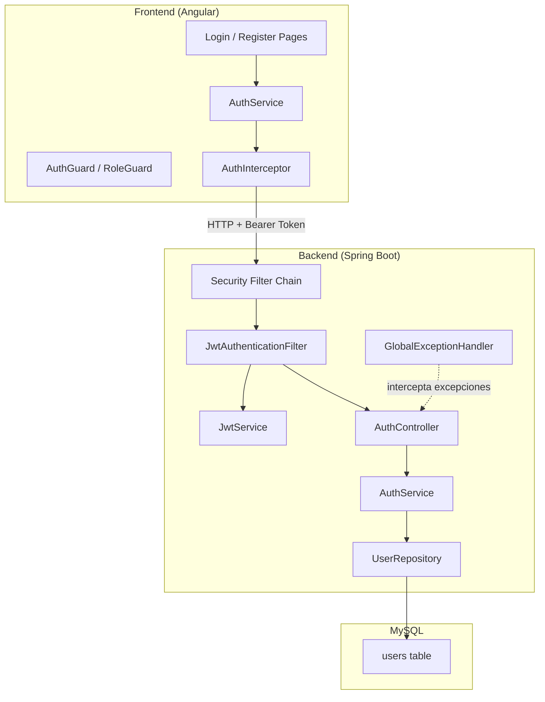
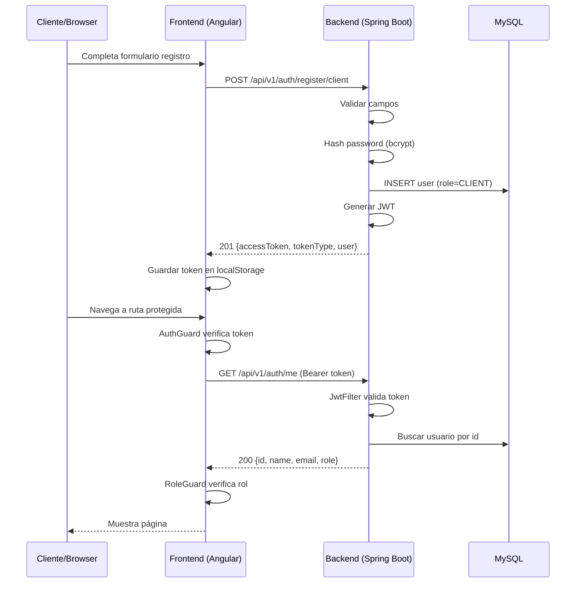
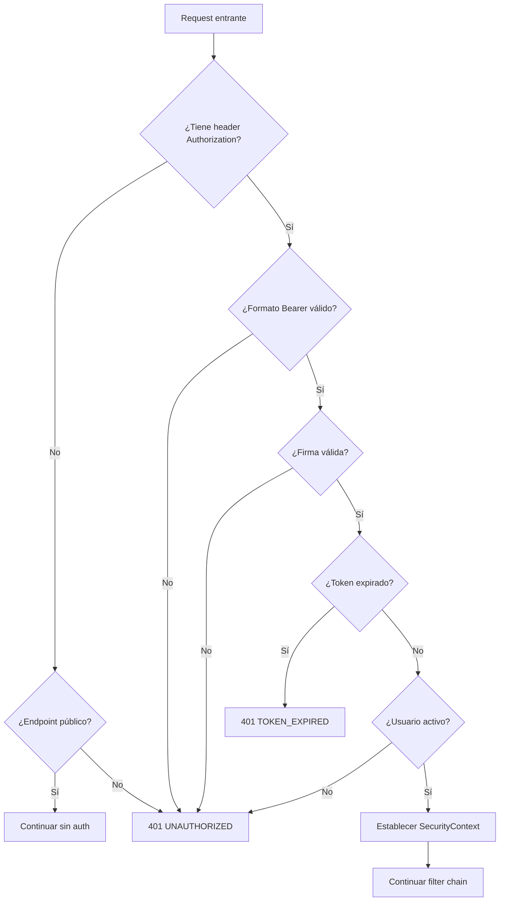

# Documento de Diseño — Fundación del Proyecto y Autenticación

## Resumen General

Este documento describe el diseño técnico para la capa fundacional de ServiPy y el sistema de autenticación. Cubre la estructura del monorepo, la configuración por variables de entorno, el endpoint de salud, el registro de usuarios (clientes y profesionales), el inicio de sesión con JWT, la autorización basada en roles, los guards del frontend, el seed de administrador y el manejo uniforme de errores.

**Stack tecnológico:**
- Frontend: Angular 17+ con Tailwind CSS
- Backend: Java 21 + Spring Boot 3.x + Spring Security
- Base de datos: MySQL 8
- Autenticación: JWT stateless (jjwt)
- Build: Maven (mvnw)
- Despliegue: AWS + Nginx

## Arquitectura

### Diagrama de Alto Nivel



### Flujo de Autenticación



### Decisiones de Diseño

| Decisión | Justificación |
|----------|---------------|
| JWT stateless (sin refresh token) | MVP con deadline corto; simplifica la implementación sin sacrificar seguridad para el alcance actual |
| Monorepo con directorios separados | Facilita coordinación en equipo pequeño; un solo PR puede tocar frontend y backend |
| bcrypt para hashing | Estándar de industria, resistente a ataques de fuerza bruta con factor de costo configurable |
| Roles como enum en BD | Solo 3 roles fijos en el MVP; no necesita tabla separada |
| Validación de env vars al arranque | Fail-fast: detectar configuración inválida inmediatamente en vez de en runtime |
| @ControllerAdvice para errores | Punto único de transformación de excepciones a Error_Uniforme |
| DTOs separados de entidades | Desacopla contrato API del modelo de persistencia; permite evolucionar ambos independientemente |

## Componentes e Interfaces

### Estructura del Monorepo

```
servipy/
├── frontend/                  # Angular + Tailwind CSS
│   ├── src/
│   │   ├── app/
│   │   │   ├── core/          # Servicios singleton, guards, interceptors
│   │   │   │   ├── guards/
│   │   │   │   │   ├── auth.guard.ts
│   │   │   │   │   └── role.guard.ts
│   │   │   │   ├── interceptors/
│   │   │   │   │   └── auth.interceptor.ts
│   │   │   │   ├── services/
│   │   │   │   │   └── auth.service.ts
│   │   │   │   └── models/
│   │   │   │       ├── user.model.ts
│   │   │   │       └── auth-response.model.ts
│   │   │   ├── features/
│   │   │   │   ├── auth/       # Login, Register
│   │   │   │   ├── client/     # Páginas de cliente
│   │   │   │   ├── professional/ # Páginas de profesional
│   │   │   │   └── admin/      # Páginas de administrador
│   │   │   ├── shared/         # Componentes reutilizables
│   │   │   └── app.routes.ts
│   │   ├── environments/
│   │   └── styles.css          # Tailwind imports
│   ├── angular.json
│   ├── tailwind.config.js
│   └── package.json
├── backend/                   # Spring Boot + Spring Security
│   ├── src/main/java/com/servipy/api/
│   │   ├── config/
│   │   │   ├── SecurityConfig.java
│   │   │   ├── CorsConfig.java
│   │   │   └── EnvValidationConfig.java
│   │   ├── security/
│   │   │   ├── JwtService.java
│   │   │   ├── JwtAuthenticationFilter.java
│   │   │   └── UserDetailsServiceImpl.java
│   │   ├── controller/
│   │   │   ├── AuthController.java
│   │   │   └── HealthController.java
│   │   ├── service/
│   │   │   └── AuthService.java
│   │   ├── repository/
│   │   │   └── UserRepository.java
│   │   ├── entity/
│   │   │   ├── User.java
│   │   │   └── Role.java
│   │   ├── dto/
│   │   │   ├── request/
│   │   │   │   ├── RegisterRequest.java
│   │   │   │   └── LoginRequest.java
│   │   │   └── response/
│   │   │       ├── AuthResponse.java
│   │   │       ├── UserResponse.java
│   │   │       └── ErrorResponse.java
│   │   ├── exception/
│   │   │   ├── GlobalExceptionHandler.java
│   │   │   ├── DuplicateEmailException.java
│   │   │   └── AccountInactiveException.java
│   │   └── seed/
│   │       └── AdminSeeder.java
│   ├── src/main/resources/
│   │   └── application.yml
│   ├── src/test/java/com/servipy/api/
│   │   └── controller/
│   │       └── AuthControllerIntegrationTest.java
│   └── pom.xml
├── database/
│   └── V1__create_users_table.sql
├── docs/
│   ├── MVP.md
│   ├── API_CONTRACT.md
│   ├── DOMAIN_MODEL.md
│   ├── BRANCHING.md
│   └── DEFINITION_OF_DONE.md
├── .kiro/
│   ├── steering/
│   └── specs/
├── .github/
├── .env.example
└── README.md
```

### Backend — Componentes Principales

#### 1. SecurityConfig

Configura Spring Security con filtro JWT, endpoints públicos y reglas de autorización.

```java
@Configuration
@EnableWebSecurity
public class SecurityConfig {

    SecurityFilterChain filterChain(HttpSecurity http) {
        // - Deshabilitar CSRF (API stateless)
        // - Configurar sesión como STATELESS
        // - Definir endpoints públicos: /api/v1/health, /api/v1/auth/**
        // - Definir endpoints de admin: /api/v1/admin/** → ADMIN
        // - Resto de endpoints: authenticated
        // - Agregar JwtAuthenticationFilter antes de UsernamePasswordAuthenticationFilter
    }
}
```

#### 2. JwtService

Genera y valida tokens JWT usando la librería jjwt.

```java
@Service
public class JwtService {
    String generateToken(User user);           // Genera JWT con claims: sub, email, role, exp
    boolean isTokenValid(String token);        // Verifica firma y expiración
    Long extractUserId(String token);          // Extrae claim sub
    String extractEmail(String token);         // Extrae claim email
    String extractRole(String token);          // Extrae claim role
    Date extractExpiration(String token);      // Extrae claim exp
}
```

#### 3. JwtAuthenticationFilter

Filtro que intercepta cada request, extrae y valida el JWT, y establece el SecurityContext.

```java
@Component
public class JwtAuthenticationFilter extends OncePerRequestFilter {
    @Override
    protected void doFilterInternal(HttpServletRequest request,
                                    HttpServletResponse response,
                                    FilterChain filterChain) {
        // 1. Extraer token del header Authorization
        // 2. Si no hay token → continuar sin autenticar
        // 3. Validar token (firma + expiración)
        // 4. Verificar usuario activo en BD
        // 5. Establecer Authentication en SecurityContextHolder
        // 6. Continuar filter chain
    }
}
```

#### 4. AuthController

Expone los endpoints de autenticación.

```java
@RestController
@RequestMapping("/api/v1/auth")
public class AuthController {
    @PostMapping("/register/client")
    ResponseEntity<AuthResponse> registerClient(@Valid @RequestBody RegisterRequest request);

    @PostMapping("/register/professional")
    ResponseEntity<AuthResponse> registerProfessional(@Valid @RequestBody RegisterRequest request);

    @PostMapping("/login")
    ResponseEntity<AuthResponse> login(@Valid @RequestBody LoginRequest request);

    @GetMapping("/me")
    ResponseEntity<UserResponse> getCurrentUser(@AuthenticationPrincipal UserDetails userDetails);
}
```

#### 5. AuthService

Lógica de negocio para registro y login.

```java
@Service
public class AuthService {
    AuthResponse registerClient(RegisterRequest request);
    AuthResponse registerProfessional(RegisterRequest request);
    AuthResponse login(LoginRequest request);
    UserResponse getCurrentUser(Long userId);
}
```

Algoritmo de registro:
1. Validar campos (delegado a Bean Validation con @Valid)
2. Verificar que email no exista (case-insensitive) → lanzar DuplicateEmailException si existe
3. Hash de password con BCryptPasswordEncoder
4. Crear entidad User con rol correspondiente, active=true
5. Persistir en BD
6. Generar JWT
7. Retornar AuthResponse con token y datos del usuario

Algoritmo de login:
1. Validar campos
2. Buscar usuario por email (case-insensitive) → lanzar InvalidCredentialsException si no existe
3. Verificar password con BCryptPasswordEncoder.matches() → lanzar InvalidCredentialsException si no coincide
4. Verificar active=true → lanzar AccountInactiveException si está inactivo
5. Generar JWT
6. Retornar AuthResponse

#### 6. EnvValidationConfig

Valida variables de entorno al arranque usando @PostConstruct o ApplicationRunner.

```java
@Configuration
public class EnvValidationConfig implements ApplicationRunner {
    @Override
    public void run(ApplicationArguments args) {
        // Validar presencia y formato de:
        // - DB_URL, DB_USERNAME, DB_PASSWORD
        // - JWT_SECRET
        // - JWT_EXPIRATION_MINUTES (numérico)
        // - ADMIN_NAME, ADMIN_EMAIL, ADMIN_PASSWORD
        // Si falta alguna → lanzar IllegalStateException con nombre de variable
    }
}
```

#### 7. GlobalExceptionHandler

Transforma excepciones en Error_Uniforme.

```java
@RestControllerAdvice
public class GlobalExceptionHandler {
    @ExceptionHandler(MethodArgumentNotValidException.class)
    ResponseEntity<ErrorResponse> handleValidation(MethodArgumentNotValidException ex);
    // → 400, VALIDATION_ERROR, errors[] con field + message

    @ExceptionHandler(DuplicateEmailException.class)
    ResponseEntity<ErrorResponse> handleDuplicateEmail(DuplicateEmailException ex);
    // → 409, DUPLICATE_EMAIL

    @ExceptionHandler(HttpMessageNotReadableException.class)
    ResponseEntity<ErrorResponse> handleMalformedBody(HttpMessageNotReadableException ex);
    // → 400, MALFORMED_REQUEST

    @ExceptionHandler(HttpRequestMethodNotSupportedException.class)
    ResponseEntity<ErrorResponse> handleMethodNotAllowed(HttpRequestMethodNotSupportedException ex);
    // → 405, METHOD_NOT_ALLOWED

    @ExceptionHandler(AccountInactiveException.class)
    ResponseEntity<ErrorResponse> handleAccountInactive(AccountInactiveException ex);
    // → 403, ACCOUNT_INACTIVE

    @ExceptionHandler(Exception.class)
    ResponseEntity<ErrorResponse> handleGeneral(Exception ex);
    // → 500, INTERNAL_ERROR (sin info sensible)
}
```

#### 8. AdminSeeder

Crea el usuario admin si no existe.

```java
@Component
public class AdminSeeder implements ApplicationRunner {
    @Override
    public void run(ApplicationArguments args) {
        // 1. Leer ADMIN_EMAIL de env
        // 2. Buscar usuario por email
        // 3. Si no existe → crear con ADMIN_NAME, ADMIN_EMAIL, bcrypt(ADMIN_PASSWORD), role=ADMIN
        // 4. Si ya existe → log info y continuar
    }
}
```

### Frontend — Componentes Principales

#### 1. AuthService

Servicio central de autenticación en Angular.

```typescript
@Injectable({ providedIn: 'root' })
export class AuthService {
  private currentUser = signal<User | null>(null);

  login(email: string, password: string): Observable<AuthResponse>;
  registerClient(name: string, email: string, password: string): Observable<AuthResponse>;
  registerProfessional(name: string, email: string, password: string): Observable<AuthResponse>;
  getCurrentUser(): Observable<User>;
  logout(): void;
  getToken(): string | null;
  isAuthenticated(): boolean;
  getUserRole(): Role | null;
}
```

#### 2. AuthGuard

```typescript
export const authGuard: CanActivateFn = (route, state) => {
  const authService = inject(AuthService);
  const router = inject(Router);

  if (authService.isAuthenticated()) return true;
  router.navigate(['/login']);
  return false;
};
```

#### 3. RoleGuard

```typescript
export const roleGuard: CanActivateFn = (route, state) => {
  const authService = inject(AuthService);
  const router = inject(Router);
  const requiredRole = route.data['role'] as Role;
  const userRole = authService.getUserRole();

  if (userRole === requiredRole) return true;

  // Redirigir a página principal según rol
  const roleHomeMap: Record<Role, string> = {
    CLIENT: '/client',
    PROFESSIONAL: '/professional',
    ADMIN: '/admin'
  };
  router.navigate([roleHomeMap[userRole!]]);
  return false;
};
```

#### 4. AuthInterceptor

```typescript
export const authInterceptor: HttpInterceptorFn = (req, next) => {
  const authService = inject(AuthService);
  const router = inject(Router);
  const token = authService.getToken();

  const authReq = token
    ? req.clone({ setHeaders: { Authorization: `Bearer ${token}` } })
    : req;

  return next(authReq).pipe(
    catchError(err => {
      if (err.status === 401) {
        authService.logout(); // Limpia localStorage y estado
        router.navigate(['/login']);
      }
      return throwError(() => err);
    })
  );
};
```

#### 5. Configuración de Rutas

```typescript
export const routes: Routes = [
  { path: 'login', component: LoginComponent },
  { path: 'register', component: RegisterComponent },
  {
    path: 'client',
    canActivate: [authGuard, roleGuard],
    data: { role: 'CLIENT' },
    children: [/* rutas de cliente */]
  },
  {
    path: 'professional',
    canActivate: [authGuard, roleGuard],
    data: { role: 'PROFESSIONAL' },
    children: [/* rutas de profesional */]
  },
  {
    path: 'admin',
    canActivate: [authGuard, roleGuard],
    data: { role: 'ADMIN' },
    children: [/* rutas de administrador */]
  },
  { path: '', redirectTo: 'login', pathMatch: 'full' }
];
```

## Modelos de Datos

### Entidad User (JPA)

```java
@Entity
@Table(name = "users")
public class User {
    @Id
    @GeneratedValue(strategy = GenerationType.IDENTITY)
    private Long id;

    @Column(nullable = false, length = 100)
    private String name;

    @Column(nullable = false, unique = true, length = 255)
    private String email;

    @Column(name = "password_hash", nullable = false)
    private String passwordHash;

    @Enumerated(EnumType.STRING)
    @Column(nullable = false, length = 20)
    private Role role;

    @Column(nullable = false)
    private Boolean active = true;

    @Column(name = "created_at", nullable = false, updatable = false)
    private LocalDateTime createdAt;

    @Column(name = "updated_at", nullable = false)
    private LocalDateTime updatedAt;

    @PrePersist
    void onCreate() {
        createdAt = LocalDateTime.now();
        updatedAt = LocalDateTime.now();
    }

    @PreUpdate
    void onUpdate() {
        updatedAt = LocalDateTime.now();
    }
}
```

### Enum Role

```java
public enum Role {
    CLIENT,
    PROFESSIONAL,
    ADMIN
}
```

### Schema SQL

```sql
CREATE TABLE users (
    id BIGINT AUTO_INCREMENT PRIMARY KEY,
    name VARCHAR(100) NOT NULL,
    email VARCHAR(255) NOT NULL UNIQUE,
    password_hash VARCHAR(255) NOT NULL,
    role ENUM('CLIENT', 'PROFESSIONAL', 'ADMIN') NOT NULL,
    active BOOLEAN NOT NULL DEFAULT TRUE,
    created_at TIMESTAMP NOT NULL DEFAULT CURRENT_TIMESTAMP,
    updated_at TIMESTAMP NOT NULL DEFAULT CURRENT_TIMESTAMP ON UPDATE CURRENT_TIMESTAMP,
    INDEX idx_users_email (email),
    INDEX idx_users_role (role)
) ENGINE=InnoDB DEFAULT CHARSET=utf8mb4 COLLATE=utf8mb4_unicode_ci;
```

### DTOs

#### RegisterRequest

```java
public record RegisterRequest(
    @NotBlank @Size(min = 2, max = 100)
    String name,

    @NotBlank @Email @Size(max = 255)
    String email,

    @NotBlank @Size(min = 8, max = 72)
    String password
) {}
```

#### LoginRequest

```java
public record LoginRequest(
    @NotBlank @Email
    String email,

    @NotBlank
    String password
) {}
```

#### AuthResponse

```java
public record AuthResponse(
    String accessToken,
    String tokenType,    // siempre "Bearer"
    UserResponse user
) {}
```

#### UserResponse

```java
public record UserResponse(
    Long id,
    String name,
    String email,
    Role role
) {}
```

#### ErrorResponse

```java
public record ErrorResponse(
    String timestamp,        // ISO 8601
    int status,
    String code,             // VALIDATION_ERROR, DUPLICATE_EMAIL, etc.
    String message,
    List<FieldError> errors
) {
    public record FieldError(
        String field,
        String message
    ) {}
}
```

### Modelos Frontend (TypeScript)

```typescript
export interface User {
  id: number;
  name: string;
  email: string;
  role: Role;
}

export type Role = 'CLIENT' | 'PROFESSIONAL' | 'ADMIN';

export interface AuthResponse {
  accessToken: string;
  tokenType: string;
  user: User;
}

export interface ErrorResponse {
  timestamp: string;
  status: number;
  code: string;
  message: string;
  errors: FieldError[];
}

export interface FieldError {
  field: string;
  message: string;
}
```

### Variables de Entorno (.env.example)

```bash
# Base de datos
DB_URL=jdbc:mysql://localhost:3306/servipy
DB_USERNAME=servipy_user
DB_PASSWORD=change_me

# JWT
JWT_SECRET=change_me_to_a_secure_random_string_min_32_chars
JWT_EXPIRATION_MINUTES=60

# Admin Seed
ADMIN_NAME=Administrador
ADMIN_EMAIL=admin@servipy.com.py
ADMIN_PASSWORD=change_me_secure_password
```

### Configuración Spring Boot (application.yml)

```yaml
spring:
  datasource:
    url: ${DB_URL}
    username: ${DB_USERNAME}
    password: ${DB_PASSWORD}
    driver-class-name: com.mysql.cj.jdbc.Driver
  jpa:
    hibernate:
      ddl-auto: validate
    properties:
      hibernate:
        dialect: org.hibernate.dialect.MySQLDialect
    open-in-view: false
  jackson:
    date-format: com.fasterxml.jackson.databind.util.ISO8601DateFormat
    serialization:
      write-dates-as-timestamps: false

app:
  jwt:
    secret: ${JWT_SECRET}
    expiration-minutes: ${JWT_EXPIRATION_MINUTES}
  admin:
    name: ${ADMIN_NAME}
    email: ${ADMIN_EMAIL}
    password: ${ADMIN_PASSWORD}
```

### Configuración CORS (desarrollo local)

```java
@Configuration
public class CorsConfig implements WebMvcConfigurer {
    @Override
    public void addCorsMappings(CorsRegistry registry) {
        registry.addMapping("/api/**")
            .allowedOrigins("http://localhost:4200")
            .allowedMethods("GET", "POST", "PUT", "PATCH", "DELETE", "OPTIONS")
            .allowedHeaders("*")
            .allowCredentials(true);
    }
}
```

## Propiedades de Correctitud

*Una propiedad es una característica o comportamiento que debe cumplirse en todas las ejecuciones válidas de un sistema — esencialmente, una declaración formal sobre lo que el sistema debe hacer. Las propiedades sirven como puente entre especificaciones legibles por humanos y garantías de correctitud verificables por máquinas.*

### Propiedad 1: Registro exitoso asigna rol según endpoint

*Para cualquier* tripleta válida (name, email, password) enviada al endpoint `/auth/register/client`, el usuario creado SHALL tener role=CLIENT; para la misma tripleta enviada a `/auth/register/professional`, el usuario SHALL tener role=PROFESSIONAL.

**Valida: Requisitos 4.1, 5.1, 9.2**

### Propiedad 2: Contraseña siempre almacenada como hash bcrypt

*Para cualquier* usuario creado en el sistema (vía registro o seed), el campo passwordHash almacenado en base de datos SHALL ser un hash bcrypt válido (prefijo `$2a$` o `$2b$`) y la respuesta de la API SHALL no contener dicho hash.

**Valida: Requisitos 4.2, 5.2, 11.2**

### Propiedad 3: Unicidad de email (detección de duplicados)

*Para cualquier* email que ya existe en el sistema (comparación case-insensitive), un intento de registro en cualquier endpoint de registro SHALL recibir respuesta HTTP 409 con code `DUPLICATE_EMAIL`.

**Valida: Requisitos 4.3, 5.3**

### Propiedad 4: Validación de email rechaza formatos inválidos

*Para cualquier* cadena que no contenga exactamente un carácter `@`, o cuyo dominio no contenga al menos un punto, o que exceda 255 caracteres, el sistema SHALL rechazarla como email inválido con HTTP 400 y code `VALIDATION_ERROR`.

**Valida: Requisitos 4.5, 5.5**

### Propiedad 5: Validación de longitud de password

*Para cualquier* cadena con longitud menor a 8 o mayor a 72 caracteres, el sistema SHALL rechazarla como password inválido con HTTP 400 y code `VALIDATION_ERROR`.

**Valida: Requisitos 4.6, 5.6**

### Propiedad 6: Validación de longitud de name (trimmed)

*Para cualquier* cadena cuya longitud después de eliminar espacios iniciales y finales sea menor a 2 o mayor a 100, el sistema SHALL rechazarla como name inválido con HTTP 400 y code `VALIDATION_ERROR`.

**Valida: Requisitos 4.7, 5.7**

### Propiedad 7: Login exitoso genera JWT con claims correctos

*Para cualquier* usuario registrado y activo, al hacer login con credenciales correctas, el JWT generado SHALL contener los claims: sub=userId (numérico), email=email_del_usuario, role=rol_del_usuario, y exp con diferencia respecto al momento actual igual al valor de JWT_EXPIRATION_MINUTES (±5 segundos de tolerancia).

**Valida: Requisitos 6.1, 6.6, 8.5**

### Propiedad 8: Credenciales incorrectas retornan 401 sin revelar causa

*Para cualquier* intento de login con email no registrado o con password incorrecto, el sistema SHALL responder con HTTP 401 y code `INVALID_CREDENTIALS`, sin distinción entre ambos casos.

**Valida: Requisitos 6.3, 6.4**

### Propiedad 9: Usuario inactivo no puede autenticarse

*Para cualquier* usuario con active=false, al intentar login con credenciales correctas, el sistema SHALL responder con HTTP 403 y code `ACCOUNT_INACTIVE`.

**Valida: Requisito 6.5**

### Propiedad 10: Endpoints protegidos rechazan tokens inválidos

*Para cualquier* endpoint protegido y cualquier solicitud sin token, con token malformado, con firma inválida, o con usuario inactivo, el sistema SHALL responder con HTTP 401 y code `UNAUTHORIZED`.

**Valida: Requisitos 7.2, 7.4, 8.1, 8.2**

### Propiedad 11: Token expirado retorna código específico

*Para cualquier* endpoint protegido y cualquier solicitud con token JWT cuyo claim `exp` ya pasó, el sistema SHALL responder con HTTP 401 y code `TOKEN_EXPIRED`.

**Valida: Requisitos 7.3, 8.3**

### Propiedad 12: Matriz de permisos por rol

*Para cualquier* par (rol_usuario, endpoint), si el rol no tiene permiso sobre ese endpoint según la matriz definida (ej: CLIENT accediendo a `/api/v1/admin/*`), el sistema SHALL responder con HTTP 403 y code `FORBIDDEN`.

**Valida: Requisitos 9.3, 9.6**

### Propiedad 13: Guards del frontend redirigen según estado de autenticación

*Para cualquier* ruta protegida del frontend y un usuario no autenticado, el sistema SHALL redirigir a `/login`. Para un usuario autenticado con rol distinto al requerido por la ruta, SHALL redirigir a la página principal de su rol.

**Valida: Requisitos 10.1, 10.2**

### Propiedad 14: Interceptor adjunta token en cada solicitud protegida

*Para cualquier* solicitud HTTP a un endpoint protegido cuando existe un token en localStorage, el interceptor SHALL incluir el header `Authorization: Bearer <token>`.

**Valida: Requisito 10.4**

### Propiedad 15: Respuesta 401 dispara limpieza completa

*Para cualquier* respuesta HTTP 401 recibida por el frontend, el sistema SHALL eliminar el token de localStorage, limpiar el estado del usuario en memoria, y redirigir a `/login`.

**Valida: Requisito 10.5**

### Propiedad 16: Idempotencia del seed de administrador

*Para cualquier* estado de la base de datos donde ya existe un usuario con el email de ADMIN_EMAIL, ejecutar el seed nuevamente SHALL no crear un duplicado y SHALL no lanzar error.

**Valida: Requisito 11.4**

### Propiedad 17: Variable de entorno faltante impide arranque

*Para cualquier* variable de entorno requerida (DB_URL, DB_USERNAME, DB_PASSWORD, JWT_SECRET, JWT_EXPIRATION_MINUTES, ADMIN_NAME, ADMIN_EMAIL, ADMIN_PASSWORD) que esté ausente o vacía, el backend SHALL fallar al iniciar con un mensaje que incluya el nombre de la variable faltante.

**Valida: Requisitos 2.4, 11.5**

### Propiedad 18: Todas las respuestas de error siguen la estructura uniforme

*Para cualquier* respuesta con código HTTP >= 400 emitida por el backend, el cuerpo SHALL contener los campos: timestamp (formato ISO 8601), status (número), code (cadena en mayúsculas), message (cadena no vacía) y errors (array, posiblemente vacío).

**Valida: Requisito 12.1**

### Propiedad 19: Errores de validación incluyen detalle por campo

*Para cualquier* solicitud con N campos inválidos, la respuesta con code `VALIDATION_ERROR` SHALL contener un array errors[] con al menos N elementos, donde cada elemento tiene los atributos `field` y `message`.

**Valida: Requisito 12.2**

### Propiedad 20: Errores 500 no exponen información interna

*Para cualquier* respuesta con HTTP 500, el campo message SHALL no contener nombres de clases Java, trazas de pila (stacktrace), consultas SQL, ni rutas del sistema de archivos.

**Valida: Requisito 12.3**

### Propiedad 21: Cuerpo no-JSON retorna MALFORMED_REQUEST

*Para cualquier* solicitud a un endpoint que espera JSON cuyo cuerpo no sea JSON válido (texto plano, XML, binario, JSON truncado), el sistema SHALL responder con HTTP 400 y code `MALFORMED_REQUEST`.

**Valida: Requisito 12.4**

## Manejo de Errores

### Estrategia General

El manejo de errores se centraliza en `GlobalExceptionHandler` usando `@RestControllerAdvice`. Todas las excepciones se transforman a la estructura `ErrorResponse` antes de llegar al cliente.

### Mapeo de Excepciones

| Excepción | HTTP Status | Code | Cuándo |
|-----------|-------------|------|--------|
| `MethodArgumentNotValidException` | 400 | `VALIDATION_ERROR` | Campos inválidos en @Valid |
| `HttpMessageNotReadableException` | 400 | `MALFORMED_REQUEST` | Body no es JSON válido |
| `DuplicateEmailException` | 409 | `DUPLICATE_EMAIL` | Email ya existe |
| `BadCredentialsException` | 401 | `INVALID_CREDENTIALS` | Login con credenciales incorrectas |
| `AccountInactiveException` | 403 | `ACCOUNT_INACTIVE` | Login con cuenta inactiva |
| `AccessDeniedException` | 403 | `FORBIDDEN` | Rol sin permiso |
| `AuthenticationException` | 401 | `UNAUTHORIZED` | Sin token o token inválido |
| Token expirado (JwtException) | 401 | `TOKEN_EXPIRED` | JWT con exp pasado |
| `HttpRequestMethodNotSupportedException` | 405 | `METHOD_NOT_ALLOWED` | Método HTTP no soportado |
| `NoResourceFoundException` | 404 | `RESOURCE_NOT_FOUND` | Recurso no encontrado |
| `Exception` (general) | 500 | `INTERNAL_ERROR` | Error no esperado |

### Seguridad en Errores

- Los errores 500 NUNCA incluyen: nombres de clases, stacktrace, queries SQL, rutas del filesystem
- Los errores de credenciales no revelan si falló el email o el password
- El campo `message` siempre está en español para consistencia con el frontend

### Flujo de Error en JWT Filter



## Estrategia de Pruebas

### Enfoque Dual

La estrategia combina pruebas de ejemplo (unit/integration tests) con pruebas basadas en propiedades (property-based tests) para máxima cobertura.

### Pruebas de Integración (Backend - JUnit 5 + Spring Boot Test)

Las pruebas del Requisito 13 se implementan como integration tests con `@SpringBootTest` y `MockMvc`:

1. **Registro exitoso de cliente** → POST con datos válidos, verificar 201 + estructura correcta
2. **Registro con email duplicado** → Registrar, intentar de nuevo, verificar 409
3. **Login exitoso** → Registrar usuario, hacer login, verificar 200 + token
4. **Login con credenciales incorrectas** → Password incorrecto → 401; email no existente → 401
5. **GET /auth/me sin token** → Verificar 401
6. **GET /auth/me con token expirado** → Generar token con exp pasado, verificar 401
7. **Acceso a endpoint admin con rol CLIENT** → Verificar 403

### Pruebas Basadas en Propiedades (Backend - jqwik)

**Librería seleccionada:** [jqwik](https://jqwik.net/) — framework de PBT para JUnit 5 en Java.

**Configuración:** Mínimo 100 iteraciones por propiedad.

**Tag format:** `Feature: project-foundation-and-authentication, Property {N}: {título}`

Propiedades a implementar como tests:

| Propiedad | Generadores | Qué verifica |
|-----------|-------------|--------------|
| P1: Rol según endpoint | Nombres, emails, passwords válidos aleatorios | Role correcto en respuesta |
| P2: Bcrypt storage | Usuarios aleatorios registrados | Hash en BD con prefijo $2, no en response |
| P3: Unicidad email | Emails aleatorios, doble registro | 409 en segundo intento |
| P4: Email inválido | Strings aleatorios sin @, sin punto en dominio, >255 chars | 400 VALIDATION_ERROR |
| P5: Password length | Strings de longitud 0-7 y 73-200 | 400 VALIDATION_ERROR |
| P6: Name length | Strings con trim < 2 o > 100 | 400 VALIDATION_ERROR |
| P7: JWT claims | Usuarios aleatorios, login exitoso | Claims sub, email, role, exp correctos |
| P8: Credenciales incorrectas | Emails no registrados + passwords incorrectos | 401 sin revelar cuál falló |
| P10: Token inválido | Tokens malformados, firma con otra clave | 401 UNAUTHORIZED |
| P18: Error uniforme | Requests inválidos variados | Estructura ErrorResponse completa |
| P21: Body no-JSON | Strings aleatorios no-JSON como body | 400 MALFORMED_REQUEST |

### Pruebas Frontend (Jasmine + Karma o Jest)

- **AuthService**: Verificar login/register llaman endpoints correctos, almacenan token
- **AuthGuard**: Verificar redirección a /login si no autenticado
- **RoleGuard**: Verificar redirección según rol
- **AuthInterceptor**: Verificar adjunta token, maneja 401

### Cobertura Objetivo

- Backend: >80% en paquetes service, security, controller
- Frontend: >70% en core/ (guards, interceptors, services)
- Todas las propiedades de correctitud cubiertas por al menos un property test
