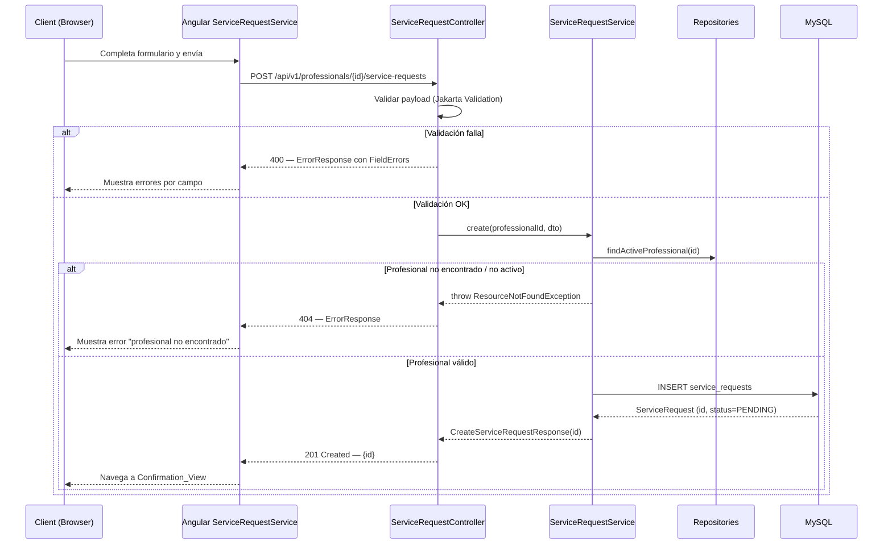
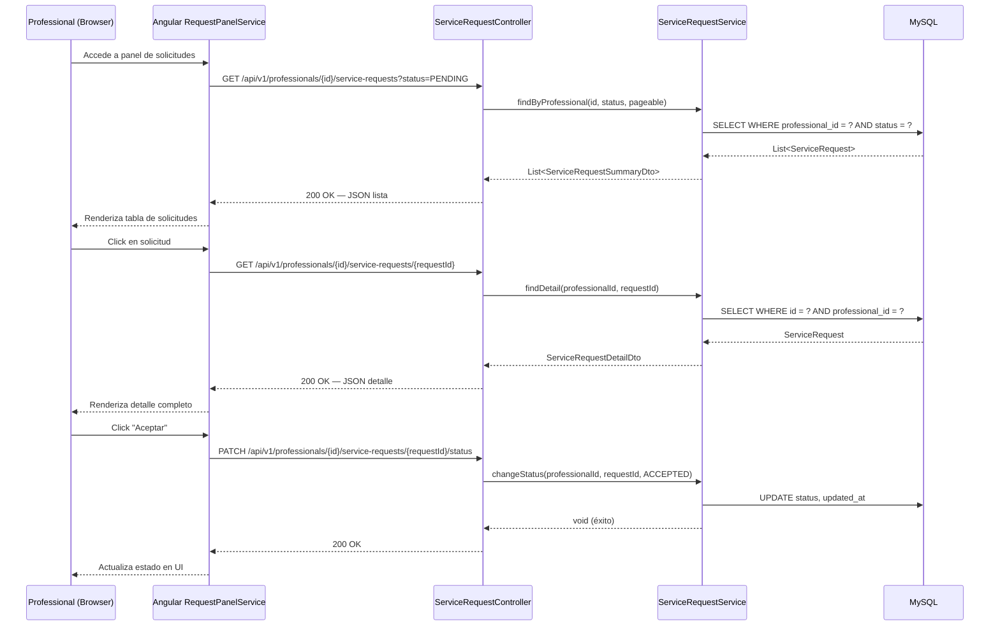

# Design Document — Solicitudes de Servicio

## Overview

Este diseño cubre el módulo de solicitudes de servicio de ServiPy: los endpoints REST que permiten a un cliente enviar una solicitud a un profesional, y al profesional consultar, ver el detalle y cambiar el estado de sus solicitudes. Incluye los componentes Angular para el formulario público de solicitud y el panel de gestión del profesional.

**Decisiones clave:**
- Nueva entidad `ServiceRequest` con máquina de estados simple (PENDING → ACCEPTED | REJECTED, sin más transiciones en MVP).
- Endpoints anidados bajo `/api/v1/professionals/{professionalId}/service-requests` para aislamiento por profesional.
- Validación con Jakarta Bean Validation en DTOs de entrada (records con annotations).
- Sin autenticación en MVP: el `professionalId` en la URL actúa como identificador de acceso temporal.
- Frontend: formulario reactivo con validación client-side + server-side, panel profesional con listado filtrable y detalle.

---

## Architecture

### Diagrama de secuencia — Crear solicitud (Cliente)



### Diagrama de secuencia — Listado y gestión (Profesional)



---

## Components and Interfaces

### Backend — Estructura vertical (nuevo paquete `servicerequest`)

```
backend/src/main/java/py/com/servipy/
├── servicerequest/
│   ├── domain/
│   │   ├── ServiceRequest.java              # JPA Entity
│   │   └── RequestStatus.java              # Enum: PENDING, ACCEPTED, REJECTED
│   ├── application/
│   │   ├── ServiceRequestService.java      # Caso de uso: crear, listar, detalle, cambiar estado
│   │   └── dto/
│   │       ├── CreateServiceRequestDto.java    # Request body (validaciones Jakarta)
│   │       ├── CreateServiceRequestResponse.java # Response 201
│   │       ├── ServiceRequestSummaryDto.java   # DTO para listado
│   │       ├── ServiceRequestDetailDto.java    # DTO para detalle
│   │       └── ChangeStatusDto.java            # Request body para PATCH
│   └── infrastructure/
│       ├── persistence/
│       │   └── ServiceRequestRepository.java   # JpaRepository
│       └── web/
│           └── ServiceRequestController.java   # REST Controller
├── professional/
│   └── infrastructure/persistence/
│       └── ProfessionalProfileRepository.java  # EXISTENTE (reutilizar)
└── shared/
    └── exception/
        ├── GlobalExceptionHandler.java         # MODIFICAR: agregar handler MethodArgumentNotValidException
        ├── InvalidStateTransitionException.java # NUEVO: para 409
        └── ResourceNotFoundException.java      # EXISTENTE
```

### Frontend — Estructura de componentes

```
frontend/src/app/
├── features/public/
│   └── catalog/
│       └── catalog-detail/
│           └── components/
│               └── service-request-form/
│                   ├── service-request-form.component.ts    # Formulario de solicitud
│                   ├── service-request-form.component.html
│                   └── service-request-form.component.spec.ts
├── features/professional/
│   ├── requests/
│   │   ├── requests.routes.ts                  # Rutas del panel
│   │   ├── request-list/
│   │   │   ├── request-list.component.ts       # Listado con filtro por estado
│   │   │   ├── request-list.component.html
│   │   │   └── request-list.component.spec.ts
│   │   ├── request-detail/
│   │   │   ├── request-detail.component.ts     # Detalle + acciones
│   │   │   ├── request-detail.component.html
│   │   │   └── request-detail.component.spec.ts
│   │   ├── components/
│   │   │   └── request-confirmation/
│   │   │       ├── request-confirmation.component.ts  # Vista de confirmación
│   │   │       └── request-confirmation.component.html
│   │   └── services/
│   │       ├── service-request.service.ts      # HTTP service
│   │       └── service-request.service.spec.ts
│   └── routes.ts                               # MODIFICAR: agregar ruta requests
└── shared/models/
    └── service-request.model.ts                # NUEVO: interfaces ServiceRequest
```

---

## Data Models

### Entidad JPA — ServiceRequest

```java
@Entity
@Table(name = "service_requests")
public class ServiceRequest {

    @Id
    @GeneratedValue(strategy = GenerationType.IDENTITY)
    private Long id;

    @ManyToOne(fetch = FetchType.LAZY)
    @JoinColumn(name = "professional_id", nullable = false)
    private ProfessionalProfile professional;

    @Column(nullable = false, length = 150)
    private String clientName;

    @Column(nullable = false)
    private String clientEmail;

    @Column(length = 20)
    private String clientPhone;

    @Column(nullable = false, length = 200)
    private String subject;

    @Column(nullable = false, columnDefinition = "TEXT")
    private String description;

    @Column(name = "desired_date")
    private LocalDate desiredDate;

    @Enumerated(EnumType.STRING)
    @Column(nullable = false)
    private RequestStatus status;

    @Column(name = "created_at", nullable = false, updatable = false)
    private Instant createdAt;

    @Column(name = "updated_at", nullable = false)
    private Instant updatedAt;

    // Getters y setters...
}
```

### Enum — RequestStatus

```java
public enum RequestStatus {
    PENDING,
    ACCEPTED,
    REJECTED;

    /**
     * Valida si la transición de estado es permitida.
     * Solo PENDING puede transicionar a ACCEPTED o REJECTED.
     */
    public boolean canTransitionTo(RequestStatus target) {
        if (this != PENDING) return false;
        return target == ACCEPTED || target == REJECTED;
    }
}
```

### DTOs de entrada

#### CreateServiceRequestDto

```java
public record CreateServiceRequestDto(
    @NotBlank(message = "El nombre es obligatorio")
    @Size(max = 150, message = "El nombre no puede exceder 150 caracteres")
    String name,

    @NotBlank(message = "El email es obligatorio")
    @Email(message = "El formato del email no es válido")
    String email,

    @Size(max = 20, message = "El teléfono no puede exceder 20 caracteres")
    String phone,

    @NotBlank(message = "El asunto es obligatorio")
    @Size(max = 200, message = "El asunto no puede exceder 200 caracteres")
    String subject,

    @NotBlank(message = "La descripción es obligatoria")
    @Size(max = 2000, message = "La descripción no puede exceder 2000 caracteres")
    String description,

    LocalDate desiredDate
) {}
```

#### ChangeStatusDto

```java
public record ChangeStatusDto(
    @NotNull(message = "El estado destino es obligatorio")
    RequestStatus status
) {}
```

### DTOs de respuesta

#### CreateServiceRequestResponse

```java
public record CreateServiceRequestResponse(
    Long id
) {}
```

#### ServiceRequestSummaryDto

```java
public record ServiceRequestSummaryDto(
    Long id,
    String clientName,
    String subject,
    String status,
    Instant createdAt
) {}
```

#### ServiceRequestDetailDto

```java
public record ServiceRequestDetailDto(
    Long id,
    String clientName,
    String clientEmail,
    String clientPhone,   // nullable
    String subject,
    String description,
    LocalDate desiredDate, // nullable
    String status,
    Instant createdAt,
    Instant updatedAt
) {}
```

### Modelos TypeScript (Frontend)

```typescript
// shared/models/service-request.model.ts

export interface CreateServiceRequestPayload {
  name: string;
  email: string;
  phone?: string;
  subject: string;
  description: string;
  desiredDate?: string; // ISO date string YYYY-MM-DD
}

export interface CreateServiceRequestResponse {
  id: number;
}

export interface ServiceRequestSummary {
  id: number;
  clientName: string;
  subject: string;
  status: 'PENDING' | 'ACCEPTED' | 'REJECTED';
  createdAt: string; // ISO timestamp
}

export interface ServiceRequestDetail {
  id: number;
  clientName: string;
  clientEmail: string;
  clientPhone: string | null;
  subject: string;
  description: string;
  desiredDate: string | null;
  status: 'PENDING' | 'ACCEPTED' | 'REJECTED';
  createdAt: string;
  updatedAt: string;
}

export interface ChangeStatusPayload {
  status: 'ACCEPTED' | 'REJECTED';
}
```

### Migración Flyway — V3__service_requests_table.sql

```sql
CREATE TABLE service_requests (
    id BIGINT AUTO_INCREMENT PRIMARY KEY,
    professional_id BIGINT NOT NULL,
    client_name VARCHAR(150) NOT NULL,
    client_email VARCHAR(255) NOT NULL,
    client_phone VARCHAR(20),
    subject VARCHAR(200) NOT NULL,
    description TEXT NOT NULL,
    desired_date DATE,
    status ENUM('PENDING','ACCEPTED','REJECTED') NOT NULL DEFAULT 'PENDING',
    created_at TIMESTAMP NOT NULL DEFAULT CURRENT_TIMESTAMP,
    updated_at TIMESTAMP NOT NULL DEFAULT CURRENT_TIMESTAMP ON UPDATE CURRENT_TIMESTAMP,
    CONSTRAINT fk_request_professional FOREIGN KEY (professional_id)
        REFERENCES professional_profiles(id)
) ENGINE=InnoDB DEFAULT CHARSET=utf8mb4;

-- Índices para consultas frecuentes
CREATE INDEX idx_requests_professional ON service_requests(professional_id);
CREATE INDEX idx_requests_status ON service_requests(status);
CREATE INDEX idx_requests_professional_status ON service_requests(professional_id, status);
CREATE INDEX idx_requests_created_at ON service_requests(created_at);
```

### Endpoints

#### ServiceRequestController

```java
@RestController
@RequestMapping("/api/v1/professionals/{professionalId}/service-requests")
public class ServiceRequestController {

    private final ServiceRequestService service;

    public ServiceRequestController(ServiceRequestService service) {
        this.service = service;
    }

    @PostMapping
    public ResponseEntity<CreateServiceRequestResponse> create(
            @PathVariable Long professionalId,
            @Valid @RequestBody CreateServiceRequestDto dto) {
        CreateServiceRequestResponse response = service.create(professionalId, dto);
        return ResponseEntity.status(HttpStatus.CREATED).body(response);
    }

    @GetMapping
    public ResponseEntity<List<ServiceRequestSummaryDto>> list(
            @PathVariable Long professionalId,
            @RequestParam(required = false) RequestStatus status) {
        List<ServiceRequestSummaryDto> list = service.findByProfessional(professionalId, status);
        return ResponseEntity.ok(list);
    }

    @GetMapping("/{requestId}")
    public ResponseEntity<ServiceRequestDetailDto> detail(
            @PathVariable Long professionalId,
            @PathVariable Long requestId) {
        ServiceRequestDetailDto detail = service.findDetail(professionalId, requestId);
        return ResponseEntity.ok(detail);
    }

    @PatchMapping("/{requestId}/status")
    public ResponseEntity<Void> changeStatus(
            @PathVariable Long professionalId,
            @PathVariable Long requestId,
            @Valid @RequestBody ChangeStatusDto dto) {
        service.changeStatus(professionalId, requestId, dto.status());
        return ResponseEntity.ok().build();
    }
}
```

### Tabla de endpoints

| Método | Ruta | Params/Body | Status | Condición |
|--------|------|-------------|--------|-----------|
| POST | `/api/v1/professionals/{professionalId}/service-requests` | Body: CreateServiceRequestDto | 201 | Profesional activo, payload válido |
| POST | `/api/v1/professionals/{professionalId}/service-requests` | Body: CreateServiceRequestDto | 400 | Campos inválidos o faltantes |
| POST | `/api/v1/professionals/{professionalId}/service-requests` | Body: CreateServiceRequestDto | 404 | Profesional no existe o no activo |
| GET | `/api/v1/professionals/{professionalId}/service-requests` | Query: `status` (opcional) | 200 | Siempre (puede estar vacío) |
| GET | `/api/v1/professionals/{professionalId}/service-requests/{requestId}` | — | 200 | Solicitud existe y pertenece al profesional |
| GET | `/api/v1/professionals/{professionalId}/service-requests/{requestId}` | — | 404 | Solicitud no existe o no pertenece al profesional |
| PATCH | `/api/v1/professionals/{professionalId}/service-requests/{requestId}/status` | Body: ChangeStatusDto | 200 | Transición válida (PENDING → ACCEPTED/REJECTED) |
| PATCH | `/api/v1/professionals/{professionalId}/service-requests/{requestId}/status` | Body: ChangeStatusDto | 404 | Solicitud no existe o no pertenece al profesional |
| PATCH | `/api/v1/professionals/{professionalId}/service-requests/{requestId}/status` | Body: ChangeStatusDto | 409 | Transición inválida |

### Servicio — ServiceRequestService

```java
@Service
@Transactional
public class ServiceRequestService {

    private final ServiceRequestRepository requestRepository;
    private final ProfessionalProfileRepository professionalRepository;

    public ServiceRequestService(ServiceRequestRepository requestRepository,
                                  ProfessionalProfileRepository professionalRepository) {
        this.requestRepository = requestRepository;
        this.professionalRepository = professionalRepository;
    }

    public CreateServiceRequestResponse create(Long professionalId, CreateServiceRequestDto dto) {
        ProfessionalProfile professional = findActiveProfessional(professionalId);

        ServiceRequest request = new ServiceRequest();
        request.setProfessional(professional);
        request.setClientName(dto.name());
        request.setClientEmail(dto.email());
        request.setClientPhone(dto.phone());
        request.setSubject(dto.subject());
        request.setDescription(dto.description());
        request.setDesiredDate(dto.desiredDate());
        request.setStatus(RequestStatus.PENDING);
        request.setCreatedAt(Instant.now());
        request.setUpdatedAt(Instant.now());

        ServiceRequest saved = requestRepository.save(request);
        return new CreateServiceRequestResponse(saved.getId());
    }

    @Transactional(readOnly = true)
    public List<ServiceRequestSummaryDto> findByProfessional(Long professionalId, RequestStatus status) {
        List<ServiceRequest> requests;
        if (status != null) {
            requests = requestRepository.findByProfessionalIdAndStatusOrderByCreatedAtDesc(professionalId, status);
        } else {
            requests = requestRepository.findByProfessionalIdOrderByCreatedAtDesc(professionalId);
        }
        return requests.stream().map(this::toSummaryDto).toList();
    }

    @Transactional(readOnly = true)
    public ServiceRequestDetailDto findDetail(Long professionalId, Long requestId) {
        ServiceRequest request = requestRepository.findByIdAndProfessionalId(requestId, professionalId)
            .orElseThrow(() -> new ResourceNotFoundException("Solicitud no encontrada"));
        return toDetailDto(request);
    }

    public void changeStatus(Long professionalId, Long requestId, RequestStatus targetStatus) {
        ServiceRequest request = requestRepository.findByIdAndProfessionalId(requestId, professionalId)
            .orElseThrow(() -> new ResourceNotFoundException("Solicitud no encontrada"));

        if (!request.getStatus().canTransitionTo(targetStatus)) {
            throw new InvalidStateTransitionException(
                "No se puede cambiar de " + request.getStatus() + " a " + targetStatus
            );
        }

        request.setStatus(targetStatus);
        request.setUpdatedAt(Instant.now());
        requestRepository.save(request);
    }

    private ProfessionalProfile findActiveProfessional(Long professionalId) {
        return professionalRepository.findById(professionalId)
            .filter(p -> p.getUser().getActive() && p.getApprovalStatus() == ApprovalStatus.APPROVED)
            .orElseThrow(() -> new ResourceNotFoundException("Profesional no encontrado"));
    }

    private ServiceRequestSummaryDto toSummaryDto(ServiceRequest r) {
        return new ServiceRequestSummaryDto(
            r.getId(), r.getClientName(), r.getSubject(),
            r.getStatus().name(), r.getCreatedAt()
        );
    }

    private ServiceRequestDetailDto toDetailDto(ServiceRequest r) {
        return new ServiceRequestDetailDto(
            r.getId(), r.getClientName(), r.getClientEmail(),
            r.getClientPhone(), r.getSubject(), r.getDescription(),
            r.getDesiredDate(), r.getStatus().name(),
            r.getCreatedAt(), r.getUpdatedAt()
        );
    }
}
```

### Repository — ServiceRequestRepository

```java
public interface ServiceRequestRepository extends JpaRepository<ServiceRequest, Long> {

    List<ServiceRequest> findByProfessionalIdOrderByCreatedAtDesc(Long professionalId);

    List<ServiceRequest> findByProfessionalIdAndStatusOrderByCreatedAtDesc(Long professionalId, RequestStatus status);

    Optional<ServiceRequest> findByIdAndProfessionalId(Long id, Long professionalId);
}
```

### Modificación a SecurityConfig

```java
.authorizeHttpRequests(auth -> auth
    .requestMatchers("/api/v1/health").permitAll()
    .requestMatchers("/actuator/health").permitAll()
    .requestMatchers(HttpMethod.GET, "/api/v1/professionals/**").permitAll()
    .requestMatchers(HttpMethod.POST, "/api/v1/professionals/*/service-requests").permitAll()
    .requestMatchers("/api/v1/professionals/*/service-requests/**").permitAll()
    .requestMatchers(HttpMethod.GET, "/api/v1/categories").permitAll()
    .anyRequest().authenticated()
)
```

> **Nota MVP**: Todos los endpoints de service-requests son públicos temporalmente. Cuando se implemente JWT, los endpoints GET/PATCH del panel profesional requerirán autenticación y se validará que el token corresponda al profesional de la URL.

### Angular — ServiceRequestService

```typescript
// features/professional/requests/services/service-request.service.ts
import { Injectable, inject } from '@angular/core';
import { Observable } from 'rxjs';
import { ApiService } from '../../../../core/http/api.service';
import {
  CreateServiceRequestPayload,
  CreateServiceRequestResponse,
  ServiceRequestSummary,
  ServiceRequestDetail,
  ChangeStatusPayload
} from '../../../../shared/models/service-request.model';

@Injectable({ providedIn: 'root' })
export class ServiceRequestService {
  private readonly api = inject(ApiService);

  create(professionalId: number, payload: CreateServiceRequestPayload): Observable<CreateServiceRequestResponse> {
    return this.api.post<CreateServiceRequestResponse>(
      `/professionals/${professionalId}/service-requests`,
      payload
    );
  }

  getByProfessional(professionalId: number, status?: string): Observable<ServiceRequestSummary[]> {
    const query = status ? `?status=${status}` : '';
    return this.api.get<ServiceRequestSummary[]>(
      `/professionals/${professionalId}/service-requests${query}`
    );
  }

  getDetail(professionalId: number, requestId: number): Observable<ServiceRequestDetail> {
    return this.api.get<ServiceRequestDetail>(
      `/professionals/${professionalId}/service-requests/${requestId}`
    );
  }

  changeStatus(professionalId: number, requestId: number, payload: ChangeStatusPayload): Observable<void> {
    return this.api.patch<void>(
      `/professionals/${professionalId}/service-requests/${requestId}/status`,
      payload
    );
  }
}
```

---

## Correctness Properties

*A property is a characteristic or behavior that should hold true across all valid executions of a system — essentially, a formal statement about what the system should do. Properties serve as the bridge between human-readable specifications and machine-verifiable correctness guarantees.*

### Property 1: Professional precondition for request creation

*For any* professional profile with any combination of `user.active` and `approvalStatus` values, the service SHALL allow request creation only when `user.active = true` AND `approvalStatus = APPROVED`. For all other combinations, the service SHALL throw `ResourceNotFoundException`.

**Validates: Requirements 1.1, 1.7**

### Property 2: Payload validation produces per-field errors

*For any* `CreateServiceRequestDto` payload where at least one required field (name, email, subject, description) is blank/null, or the email format is invalid, or description exceeds 2000 characters, the API SHALL return HTTP 400 with an `ErrorResponse` containing at least one `FieldError` entry identifying each failing field.

**Validates: Requirements 1.2, 1.3, 1.4, 1.8**

### Property 3: Successful creation invariants

*For any* valid `CreateServiceRequestDto` submitted against an active+approved professional, the created `ServiceRequest` SHALL have `status = PENDING`, a non-null `id`, and `createdAt` set to approximately the current time.

**Validates: Requirements 1.5, 1.6, 2.1**

### Property 4: Listing isolation by professional

*For any* two distinct professionals A and B, each with their own set of service requests, querying the listing endpoint for professional A SHALL return only requests where `professional_id = A`. No request belonging to professional B SHALL appear in A's results.

**Validates: Requirements 3.1, 3.4**

### Property 5: Status filter correctness

*For any* valid `RequestStatus` filter value and any set of service requests for a professional, the filtered listing SHALL return only requests whose `status` matches the filter. Every request not matching the filter SHALL be excluded.

**Validates: Requirements 3.2**

### Property 6: State machine — valid transitions from PENDING

*For any* service request with `status = PENDING` and any target status in `{ACCEPTED, REJECTED}`, calling `changeStatus` SHALL succeed and the resulting request SHALL have the target status.

**Validates: Requirements 5.1, 5.2**

### Property 7: State machine — terminal states reject all transitions

*For any* service request with `status` in `{ACCEPTED, REJECTED}` and *any* target `RequestStatus`, calling `changeStatus` SHALL throw `InvalidStateTransitionException`. The request status SHALL remain unchanged.

**Validates: Requirements 5.3**

### Property 8: Status change records updatedAt

*For any* successful status transition, the `updatedAt` timestamp on the modified request SHALL be greater than or equal to its `createdAt` and greater than or equal to the `updatedAt` value before the transition.

**Validates: Requirements 5.5**

### Property 9: Detail DTO does not leak internal identifiers

*For any* service request detail response, the DTO SHALL contain exactly the fields: id, clientName, clientEmail, clientPhone, subject, description, desiredDate, status, createdAt, updatedAt. It SHALL NOT contain `professionalId`, `professional_id`, `userId`, or any database-internal foreign key.

**Validates: Requirements 4.1, 4.3**

---

## Error Handling

### Excepciones del backend

| Excepción | HTTP Status | Código | Mensaje |
|-----------|-------------|--------|---------|
| `MethodArgumentNotValidException` | 400 | `VALIDATION_ERROR` | "Error de validación" + lista de FieldError |
| `ResourceNotFoundException` | 404 | `RESOURCE_NOT_FOUND` | "Profesional no encontrado" / "Solicitud no encontrada" |
| `InvalidStateTransitionException` | 409 | `INVALID_STATE_TRANSITION` | "No se puede cambiar de {current} a {target}" |
| `HttpMessageNotReadableException` | 400 | `MALFORMED_REQUEST` | "El cuerpo de la solicitud no es válido" |
| `Exception` (genérica) | 500 | `INTERNAL_ERROR` | "Ha ocurrido un error interno del servidor" |

### InvalidStateTransitionException (nueva)

```java
package py.com.servipy.shared.exception;

public class InvalidStateTransitionException extends RuntimeException {
    public InvalidStateTransitionException(String message) {
        super(message);
    }
}
```

### Handlers adicionales en GlobalExceptionHandler

```java
@ExceptionHandler(MethodArgumentNotValidException.class)
public ResponseEntity<ErrorResponse> handleValidation(MethodArgumentNotValidException ex) {
    List<ErrorResponse.FieldError> fieldErrors = ex.getBindingResult()
        .getFieldErrors().stream()
        .map(fe -> new ErrorResponse.FieldError(fe.getField(), fe.getDefaultMessage()))
        .toList();

    ErrorResponse response = new ErrorResponse(
        Instant.now().toString(),
        HttpStatus.BAD_REQUEST.value(),
        "VALIDATION_ERROR",
        "Error de validación",
        fieldErrors
    );
    return ResponseEntity.status(HttpStatus.BAD_REQUEST).body(response);
}

@ExceptionHandler(InvalidStateTransitionException.class)
public ResponseEntity<ErrorResponse> handleInvalidTransition(InvalidStateTransitionException ex) {
    ErrorResponse response = new ErrorResponse(
        Instant.now().toString(),
        HttpStatus.CONFLICT.value(),
        "INVALID_STATE_TRANSITION",
        ex.getMessage(),
        List.of()
    );
    return ResponseEntity.status(HttpStatus.CONFLICT).body(response);
}
```

### Manejo de errores en frontend

- **ServiceRequestFormComponent**: captura 400 y muestra errores por campo bajo cada input; captura 404 y muestra "Profesional no disponible".
- **RequestListComponent**: captura errores HTTP y muestra estado de error con opción de reintentar.
- **RequestDetailComponent**: captura 404 y muestra "Solicitud no encontrada"; captura 409 y muestra toast con mensaje del servidor.

---

## Testing Strategy

### Enfoque dual: Unit Tests + Property-Based Tests

La estrategia combina tests unitarios para ejemplos concretos y edge cases, con property-based tests para verificar propiedades universales de la lógica de dominio (máquina de estados, validación, aislamiento).

### Backend — Unit Tests (JUnit 5 + Mockito)

**Convención de nombrado:** `should_<resultado>_when_<condición>`

#### ServiceRequestServiceTest

| Test | Cubre |
|------|-------|
| `should_createRequest_when_professionalIsActiveAndApproved` | Req 1.1, 1.5 |
| `should_throw404_when_professionalNotFound` | Req 1.7 |
| `should_throw404_when_professionalNotActive` | Req 1.7 |
| `should_throw404_when_professionalNotApproved` | Req 1.7 |
| `should_returnOnlyOwnRequests_when_listByProfessional` | Req 3.1 |
| `should_filterByStatus_when_statusProvided` | Req 3.2 |
| `should_returnAllRequests_when_noStatusFilter` | Req 3.2 |
| `should_returnDetail_when_requestExistsForProfessional` | Req 4.1 |
| `should_throw404_when_requestNotFound` | Req 4.2 |
| `should_throw404_when_requestBelongsToOtherProfessional` | Req 3.4 |
| `should_acceptRequest_when_statusIsPending` | Req 5.1 |
| `should_rejectRequest_when_statusIsPending` | Req 5.2 |
| `should_throw409_when_statusIsAccepted` | Req 5.3 |
| `should_throw409_when_statusIsRejected` | Req 5.3 |
| `should_updateTimestamp_when_statusChanges` | Req 5.5 |

#### Controller Integration Tests (MockMvc)

| Test | Cubre |
|------|-------|
| `should_return201_when_validPayload` | Req 2.1 |
| `should_return400_when_nameMissing` | Req 1.2, 1.8 |
| `should_return400_when_emailInvalid` | Req 1.3 |
| `should_return400_when_descriptionTooLong` | Req 1.4 |
| `should_return404_when_professionalNotExists` | Req 1.7 |
| `should_return200_when_listRequests` | Req 3.1 |
| `should_return200_when_detailExists` | Req 4.1 |
| `should_return409_when_invalidTransition` | Req 5.3 |

### Backend — Property-Based Tests (jqwik)

**Librería**: [jqwik](https://jqwik.net/) — framework PBT para JUnit 5 en Java.
**Mínimo 100 iteraciones por propiedad.**
**Tag**: Comentario `// Feature: service-request, Property N: <title>`

| Test | Property |
|------|----------|
| `professionalPrecondition_shouldOnlyAllowActiveApproved` | Prop 1 |
| `invalidPayload_shouldReturn400WithFieldErrors` | Prop 2 |
| `successfulCreation_shouldAlwaysProducePendingWithIdAndTimestamp` | Prop 3 |
| `listingIsolation_shouldOnlyReturnOwnRequests` | Prop 4 |
| `statusFilter_shouldOnlyReturnMatchingStatus` | Prop 5 |
| `validTransitionsFromPending_shouldSucceed` | Prop 6 |
| `terminalStates_shouldRejectAllTransitions` | Prop 7 |
| `statusChange_shouldUpdateTimestamp` | Prop 8 |
| `detailDto_shouldNotLeakInternalIds` | Prop 9 |

### Frontend — Unit Tests (Jasmine + Karma)

**Convención**: `it('should <comportamiento esperado>')`

#### ServiceRequestService (HttpClientTestingModule)

| Test | Cubre |
|------|-------|
| `it('should POST to /professionals/:id/service-requests')` | Req 1.1 |
| `it('should GET /professionals/:id/service-requests')` | Req 3.1 |
| `it('should GET /professionals/:id/service-requests with status param')` | Req 3.2 |
| `it('should GET /professionals/:id/service-requests/:requestId')` | Req 4.1 |
| `it('should PATCH /professionals/:id/service-requests/:requestId/status')` | Req 5.1 |

#### ServiceRequestFormComponent

| Test | Cubre |
|------|-------|
| `it('should disable submit when form is invalid')` | Req 1.2 |
| `it('should show email validation error for invalid format')` | Req 1.3 |
| `it('should show error when description exceeds 2000 chars')` | Req 1.4 |
| `it('should disable submit button while request is in progress')` | Req 2.3 |
| `it('should navigate to confirmation on success')` | Req 2.2 |
| `it('should display server-side field errors')` | Req 1.8 |

#### RequestListComponent

| Test | Cubre |
|------|-------|
| `it('should display list of requests')` | Req 3.1 |
| `it('should filter by status when selected')` | Req 3.2 |
| `it('should show loading state while fetching')` | UI |
| `it('should show empty state when no requests')` | UI |

#### RequestDetailComponent

| Test | Cubre |
|------|-------|
| `it('should display full request detail')` | Req 4.1 |
| `it('should show accept/reject buttons when status is PENDING')` | Req 5.1, 5.2 |
| `it('should hide action buttons when status is terminal')` | Req 5.3 |
| `it('should show error toast on 409 conflict')` | Req 5.3 |

### Dependencia PBT a agregar

**Backend** (`pom.xml`) — ya debería existir del spec anterior:
```xml
<dependency>
    <groupId>net.jqwik</groupId>
    <artifactId>jqwik</artifactId>
    <version>1.8.5</version>
    <scope>test</scope>
</dependency>
```

---

## Archivos a crear o modificar

### Backend — Archivos nuevos

| Archivo | Descripción |
|---------|-------------|
| `src/main/java/py/com/servipy/servicerequest/domain/ServiceRequest.java` | Entidad JPA |
| `src/main/java/py/com/servipy/servicerequest/domain/RequestStatus.java` | Enum con lógica de transición |
| `src/main/java/py/com/servipy/servicerequest/application/ServiceRequestService.java` | Servicio con lógica de negocio |
| `src/main/java/py/com/servipy/servicerequest/application/dto/CreateServiceRequestDto.java` | DTO entrada con validaciones |
| `src/main/java/py/com/servipy/servicerequest/application/dto/CreateServiceRequestResponse.java` | DTO respuesta 201 |
| `src/main/java/py/com/servipy/servicerequest/application/dto/ServiceRequestSummaryDto.java` | DTO listado |
| `src/main/java/py/com/servipy/servicerequest/application/dto/ServiceRequestDetailDto.java` | DTO detalle |
| `src/main/java/py/com/servipy/servicerequest/application/dto/ChangeStatusDto.java` | DTO cambio de estado |
| `src/main/java/py/com/servipy/servicerequest/infrastructure/persistence/ServiceRequestRepository.java` | Repositorio JPA |
| `src/main/java/py/com/servipy/servicerequest/infrastructure/web/ServiceRequestController.java` | Controller REST |
| `src/main/java/py/com/servipy/shared/exception/InvalidStateTransitionException.java` | Excepción 409 |
| `src/main/resources/db/migration/V3__service_requests_table.sql` | Migración DDL |
| `src/test/java/py/com/servipy/servicerequest/application/ServiceRequestServiceTest.java` | Unit tests |
| `src/test/java/py/com/servipy/servicerequest/application/ServiceRequestPropertyTest.java` | Property tests |
| `src/test/java/py/com/servipy/servicerequest/infrastructure/web/ServiceRequestControllerTest.java` | Integration tests |

### Backend — Archivos a modificar

| Archivo | Cambio |
|---------|--------|
| `src/main/java/py/com/servipy/shared/config/SecurityConfig.java` | Agregar whitelist para endpoints de service-requests |
| `src/main/java/py/com/servipy/shared/exception/GlobalExceptionHandler.java` | Agregar handlers: `MethodArgumentNotValidException`, `InvalidStateTransitionException` |

### Frontend — Archivos nuevos

| Archivo | Descripción |
|---------|-------------|
| `src/app/shared/models/service-request.model.ts` | Interfaces TypeScript |
| `src/app/features/public/catalog/catalog-detail/components/service-request-form/service-request-form.component.ts` | Formulario solicitud |
| `src/app/features/public/catalog/catalog-detail/components/service-request-form/service-request-form.component.html` | Template formulario |
| `src/app/features/public/catalog/catalog-detail/components/service-request-form/service-request-form.component.spec.ts` | Tests formulario |
| `src/app/features/professional/requests/requests.routes.ts` | Rutas panel profesional |
| `src/app/features/professional/requests/request-list/request-list.component.ts` | Listado solicitudes |
| `src/app/features/professional/requests/request-list/request-list.component.html` | Template listado |
| `src/app/features/professional/requests/request-list/request-list.component.spec.ts` | Tests listado |
| `src/app/features/professional/requests/request-detail/request-detail.component.ts` | Detalle solicitud |
| `src/app/features/professional/requests/request-detail/request-detail.component.html` | Template detalle |
| `src/app/features/professional/requests/request-detail/request-detail.component.spec.ts` | Tests detalle |
| `src/app/features/professional/requests/components/request-confirmation/request-confirmation.component.ts` | Vista confirmación |
| `src/app/features/professional/requests/components/request-confirmation/request-confirmation.component.html` | Template confirmación |
| `src/app/features/professional/requests/services/service-request.service.ts` | Servicio HTTP |
| `src/app/features/professional/requests/services/service-request.service.spec.ts` | Tests servicio |

### Frontend — Archivos a modificar

| Archivo | Cambio |
|---------|--------|
| `src/app/features/professional/routes.ts` | Agregar ruta `requests` con lazy-load |

### Database

| Archivo | Descripción |
|---------|-------------|
| `backend/src/main/resources/db/migration/V3__service_requests_table.sql` | Tabla `service_requests` con índices |
