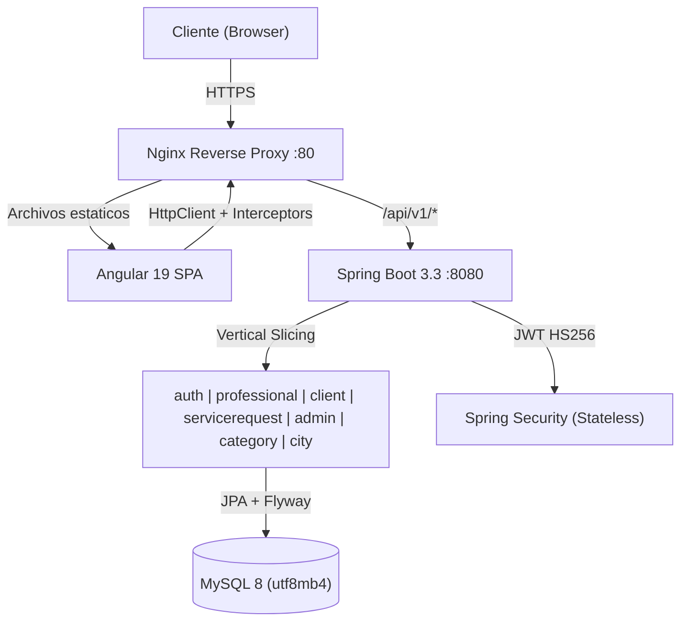
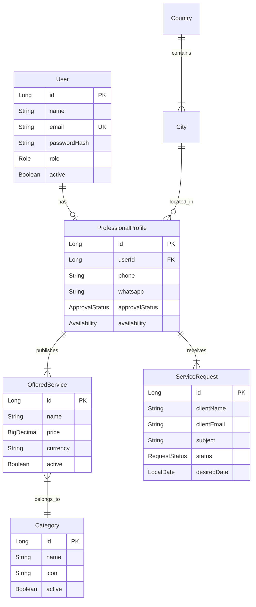

# ServiPy — Conectando Servicios Profesionales en Paraguay


> La plataforma web integral que digitaliza la contratacion de servicios profesionales independientes en Paraguay con confianza, transparencia y contacto directo.

---

## Arranque Rapido (Windows - `deploy.bat`)

Este es el camino mas corto para levantar toda la plataforma en tu maquina con Docker.

### Requisitos previos

- **Docker Desktop** instalado y corriendo (con Docker Compose integrado)
- Imagen `mysql:8.0` disponible (se descarga automaticamente si no la tenes)
- Puerto **80** (frontend), **8080** (backend) y **3306** (MySQL) libres

### Pasos

```bash
# 1. Clonar el repositorio
git clone https://github.com/tu-usuario/servipy.git
cd servipy

# 2. Crear el archivo de variables de entorno
cp .env.example .env
```

Edita `.env` y completa los valores vacios obligatorios:

```env
MYSQL_DATABASE=
MYSQL_ROOT_PASSWORD=
MYSQL_USER=
MYSQL_PASSWORD=
JWT_SECRET=
```

Los demas valores ya vienen con defaults funcionales para desarrollo.

```bash
# 3. Ejecutar el script de despliegue
.\deploy.bat
```

El script hace lo siguiente automaticamente:
1. Carga las variables de `.env`
2. Levanta los 3 contenedores con `docker compose up -d --build` (MySQL, Backend, Frontend)
3. Espera a que Flyway migre el esquema de base de datos
4. Carga los datos de prueba desde `database/seed.sql`

### Resultado

| Servicio | URL | Notas |
|----------|-----|-------|
| Frontend | http://localhost | Landing page con buscador |
| Backend API | http://localhost:8080/api/v1/health | Debe devolver `{"status":"UP"}` |
| MySQL | localhost:3306 | Accesible con las credenciales del `.env` |

### Variables de entorno involucradas

| Variable | Requerida | Default | Descripcion |
|----------|-----------|---------|-------------|
| `MYSQL_DATABASE` | Si | — | Nombre de la base de datos |
| `MYSQL_ROOT_PASSWORD` | Si | — | Contraseña del root de MySQL |
| `MYSQL_USER` | Si | — | Usuario de la aplicacion |
| `MYSQL_PASSWORD` | Si | — | Contraseña del usuario |
| `MYSQL_HOST` | No | `mysql_db` | Host de MySQL (nombre del servicio en Docker) |
| `MYSQL_PORT` | No | `3306` | Puerto de MySQL |
| `JWT_SECRET` | Si | — | Clave para firmar tokens JWT (min 32 caracteres) |
| `JWT_EXPIRATION_MINUTES` | No | `30` | Tiempo de vida del access token |
| `CORS_ALLOWED_ORIGIN` | No | `http://localhost` | Origen permitido por CORS |
| `SPRING_PROFILES_ACTIVE` | No | `local` | Perfil Spring (`local` o `prod`) |
| `PORT` | No | `8080` | Puerto del backend |

> El `docker-compose.yml` fuerza `SPRING_PROFILES_ACTIVE=prod` dentro del contenedor del backend, independientemente del valor en `.env`. Esto asegura que use la URL de MySQL correcta (`mysql_db:3306` en lugar de `localhost:3306`).

### Credenciales de prueba (seed)

Contraseña para todas las cuentas: **`password123`**

| Rol | Email | Notas |
|-----|-------|-------|
| ADMIN | `admin@servipy.com` | Acceso al panel de moderacion |
| CLIENT | `carlos@example.com` | Tiene solicitud en estado PENDING |
| CLIENT | `maria@example.com` | Tiene solicitud ACCEPTED (puede ver contacto WhatsApp) |
| CLIENT | `juan@example.com` | Tiene solicitud REJECTED |
| PROFESSIONAL | `roberto@example.com` | Plomero, APPROVED, con solicitudes |
| PROFESSIONAL | `ana@example.com` | Electricista, APPROVED |
| PROFESSIONAL | `pedro@example.com` | Limpieza, APPROVED |
| PROFESSIONAL | `laura@example.com` | Pintora, APPROVED |
| PROFESSIONAL | `diego@example.com` | Jardinero, PENDING (no visible en catalogo) |

## Vision del Producto

### El problema

En Paraguay, la busqueda de profesionales de servicios (plomeros, electricistas, pintores, carpinteros) depende de recomendaciones boca a boca, grupos de redes sociales y listados dispersos sin verificacion. No hay transparencia de precios, no hay forma de confirmar disponibilidad y el contacto depende de intercambiar numeros por mensajes privados sin garantia de respuesta.

### La solucion

ServiPy centraliza la oferta de servicios profesionales en una plataforma web donde:

**Para el Cliente:**
- Busca profesionales por categoria, ciudad y texto libre
- Consulta perfiles verificados con tarifario publico y transparente
- Envia solicitudes detallando el trabajo que necesita
- Recibe contacto directo por WhatsApp cuando el profesional acepta

**Para el Profesional:**
- Publica su perfil y tarifario sin costo
- Recibe solicitudes filtradas por su area de servicio
- Decide que trabajos aceptar o rechazar
- Conecta con el cliente por WhatsApp al aceptar

**Para el Administrador:**
- Modera que profesionales son visibles en la plataforma
- Gestiona el catalogo de categorias de servicio
- Garantiza calidad minima de los perfiles publicados

---

## Arquitectura



### Stack tecnologico

| Capa | Tecnologia | Detalle |
|------|-----------|---------|
| Frontend | Angular 19 | Standalone components, Signals, Reactive Forms, Lazy Loading |
| Estilos | Tailwind CSS 3 | Mobile-first, responsive |
| Backend | Spring Boot 3.3 | Java 21, Maven Wrapper |
| Seguridad | Spring Security + JWT | Access token 30min, BCrypt, roles |
| Base de datos | MySQL 8 | utf8mb4, Flyway migrations |
| ORM | Hibernate 6.5 (JPA) | ddl-auto: validate |
| Tests | JUnit 5 + Mockito + MockMvc | 72 tests (backend) |
| Infraestructura | Docker Compose | 3 servicios + Nginx proxy |

### Arquitectura del backend: Vertical Slicing

```
py.com.servipy/
├── shared/          # Config, excepciones globales, filtros JWT
├── auth/            # Registro, login, emision de tokens
├── user/            # Entidad User, repositorio
├── category/        # Catalogo de categorias
├── city/            # Catalogo de ciudades
├── professional/    # Perfil, tarifario, catalogo publico, moderacion
├── client/          # Perfil del cliente, historial de solicitudes
├── servicerequest/  # Creacion y gestion de solicitudes
└── health/          # Endpoint de verificacion
```

Cada slice tiene: `domain/` (entidades) → `application/` (casos de uso + DTOs) → `infrastructure/` (controllers + repositories).

---

## Funcionalidades del MVP

| Feature | Estado | Descripcion |
|---------|--------|-------------|
| Registro y Login | Implementado | JWT con roles CLIENT/PROFESSIONAL/ADMIN |
| Catalogo publico | Implementado | Filtros por categoria, ciudad, texto libre + paginacion |
| Perfil del profesional | Implementado | Onboarding wizard (datos + servicios + confirmacion) |
| Tarifario (CRUD) | Implementado | GET/POST/DELETE servicios ofrecidos con precio y moneda |
| Solicitudes de servicio | Implementado | Creacion publica, gestion por el profesional (accept/reject) |
| Contacto por WhatsApp | Implementado | Solo disponible tras aceptacion de la solicitud |
| Historial del cliente | Implementado | Lista paginada + detalle + badge de estado |
| Perfil del cliente | Implementado | Datos personales, foto, cambio de contraseña (formularios separados) |
| Panel de administracion | Implementado | Moderacion de profesionales + gestion de categorias |
| Landing page | Implementado | Hero con buscador, categorias populares, "como funciona" |
| Seguridad | Implementado | Endpoints protegidos, ownership verification, error uniforme 401/403 |
| Deploy | Implementado | Docker Compose + deploy.bat (Windows) + deploy.sh (Linux) |

---

## Contrato de API

Prefijo: `/api/v1` | Formato: JSON | Auth: `Authorization: Bearer <token>`

| Area | Metodo | Ruta | Acceso |
|------|--------|------|--------|
| Health | GET | `/health` | Publico |
| Auth | POST | `/auth/register/client` | Publico |
| Auth | POST | `/auth/register/professional` | Publico |
| Auth | POST | `/auth/login` | Publico |
| Auth | GET | `/auth/me` | Autenticado |
| Categorias | GET | `/categories` | Publico |
| Ciudades | GET | `/cities` | Publico |
| Catalogo | GET | `/professionals` | Publico |
| Catalogo | GET | `/professionals/{id}` | Publico (sin datos de contacto) |
| Catalogo | GET | `/professionals/category-counts` | Publico |
| Perfil Pro | GET | `/professional/profile/me` | PROFESSIONAL |
| Perfil Pro | POST | `/professional/profile` | PROFESSIONAL |
| Tarifario | GET | `/professional/profile/services` | PROFESSIONAL |
| Tarifario | POST | `/professional/profile/services` | PROFESSIONAL |
| Tarifario | DELETE | `/professional/profile/services/{id}` | PROFESSIONAL |
| Solicitudes | POST | `/professionals/{id}/service-requests` | Publico |
| Solicitudes | GET | `/professionals/{id}/service-requests` | PROFESSIONAL (owner) |
| Solicitudes | GET | `/professionals/{id}/service-requests/{rid}` | PROFESSIONAL (owner) |
| Solicitudes | PATCH | `/professionals/{id}/service-requests/{rid}/status` | PROFESSIONAL (owner) |
| Cliente | GET | `/client/profile` | CLIENT |
| Cliente | PUT | `/client/profile` | CLIENT |
| Cliente | PUT | `/client/profile/photo` | CLIENT |
| Cliente | PUT | `/client/profile/password` | CLIENT |
| Cliente | GET | `/client/requests` | CLIENT |
| Cliente | GET | `/client/requests/{id}` | CLIENT |
| Cliente | GET | `/client/requests/{id}/contact` | CLIENT (solo si ACCEPTED) |
| Admin | GET | `/admin/professionals/pending` | ADMIN |
| Admin | PATCH | `/admin/professionals/{id}/approve` | ADMIN |
| Admin | PATCH | `/admin/professionals/{id}/reject` | ADMIN |
| Admin | POST | `/admin/categories` | ADMIN |

### Formato de error uniforme

Toda respuesta de error (incluidas las de la cadena de seguridad) usa la misma estructura:

```json
{
  "timestamp": "2026-07-29T20:00:00Z",
  "status": 400,
  "code": "VALIDATION_ERROR",
  "message": "Error de validacion en los datos enviados",
  "errors": [{ "field": "email", "message": "Debe ser un correo valido" }]
}
```

---

## Modelo de Dominio



---

## Seguridad

- **Autenticacion**: JWT (HS256) con access token de 30 minutos
- **Autorizacion**: por rol (`CLIENT`, `PROFESSIONAL`, `ADMIN`) + verificacion de ownership
- **Datos de contacto**: telefono y WhatsApp del profesional **no se exponen en el catalogo publico**; solo se entregan al cliente cuando su solicitud esta `ACCEPTED`
- **Passwords**: BCrypt, nunca en respuestas de API
- **Validacion**: Bean Validation en todos los DTOs, errores campo por campo
- **Uploads**: verificacion por magic bytes (no solo Content-Type), UUID como nombre, max 5MB
- **CORS**: origen unico configurable por entorno
- **Secretos**: prohibidos en el repositorio; todo por variables de entorno

---

## Tests

```bash
# Backend (72 tests: unitarios + integracion)
cd backend && mvnw.cmd test

# Frontend (Karma + ChromeHeadless)
cd frontend && npm test
```

Cobertura priorizada en: autenticacion, solicitudes de servicio, moderacion de profesionales, catalogo publico, gestion de tarifario y seguridad de endpoints.

---

## Estructura del Proyecto

```
servipy/
├── frontend/                 # Angular 19 SPA
│   ├── src/app/
│   │   ├── core/            # Auth, guards, interceptors, ApiService, layout
│   │   ├── shared/          # Modelos, componentes reutilizables
│   │   └── features/        # public, authentication, client, professional, administration
│   └── Dockerfile
├── backend/                  # Spring Boot 3.3 API
│   ├── src/main/java/py/com/servipy/
│   │   ├── shared/          # Config, excepciones, filtro JWT
│   │   └── <feature>/       # domain/ + application/ + infrastructure/
│   ├── src/main/resources/
│   │   ├── db/migration/    # Flyway V1..V4
│   │   └── application*.yml # Perfiles: base, local, prod, test
│   └── Dockerfile
├── database/
│   ├── schema.sql           # Charset del contenedor MySQL
│   └── seed.sql             # Datos de prueba (NO produccion)
├── docker-compose.yml        # 3 servicios: mysql + backend + frontend
├── deploy.sh                 # Script de despliegue (Linux/macOS)
├── deploy.bat                # Script de despliegue (Windows)
├── .env.example              # Plantilla de variables de entorno
└── PROJECT.md                # Fuente unica de verdad del proyecto
```

---

## Documentacion

| Documento | Descripcion |
|-----------|-------------|
| [`PROJECT.md`](PROJECT.md) | Fuente unica de verdad: reglas de negocio, arquitectura, contrato de API, convenciones |
| [`backend/README.md`](backend/README.md) | Setup local del backend, arquitectura de slices, perfiles Spring |
| [`frontend/README.md`](frontend/README.md) | Setup local del frontend, estructura de carpetas, manejo de estado |
| [`docs/DOMAIN_MODEL.md`](docs/DOMAIN_MODEL.md) | Modelo de dominio detallado |
| [`docs/API_CONTRACT.md`](docs/API_CONTRACT.md) | Referencia al contrato de API |
| [`docs/BRANCHING.md`](docs/BRANCHING.md) | Estrategia de ramas |
| [`docs/DEFINITION_OF_DONE.md`](docs/DEFINITION_OF_DONE.md) | Criterios de terminado |

---

## Equipo

**NandeCodigo Inc.** — Hackathon Kiro AI 2026

---

<p align="center">
  <sub>Hecho con Java, Angular y mucho terere en Paraguay</sub>
</p>
